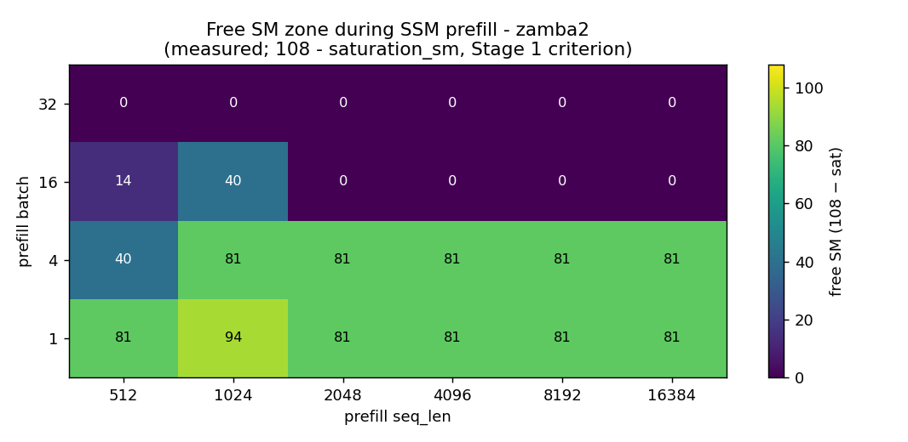
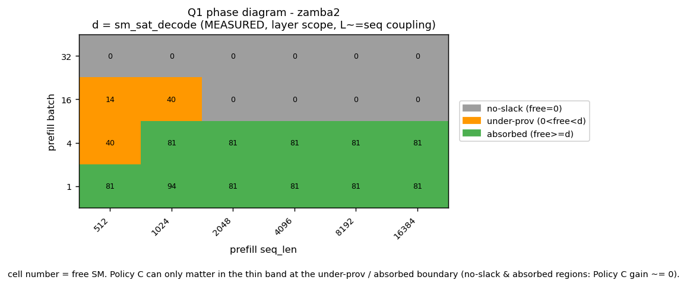
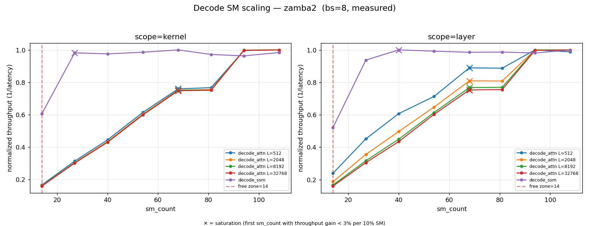
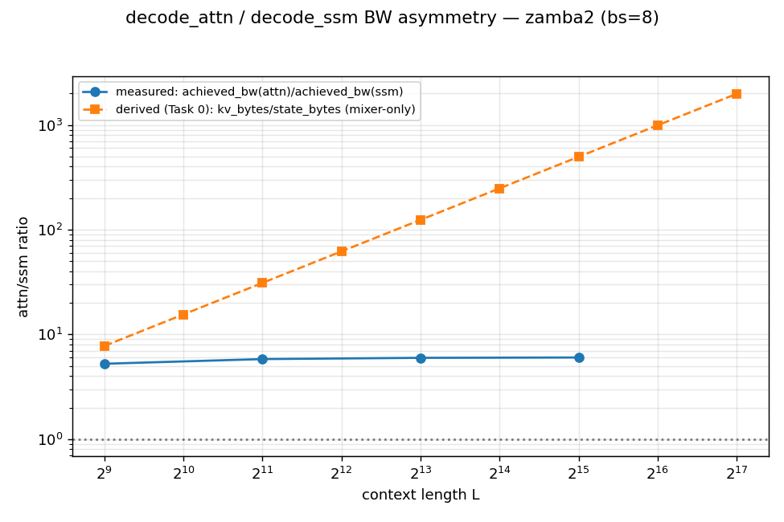
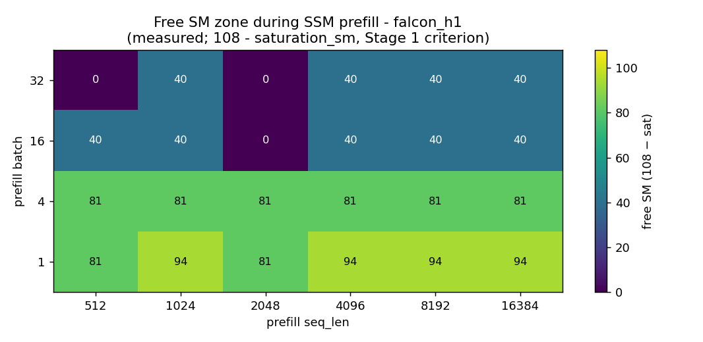
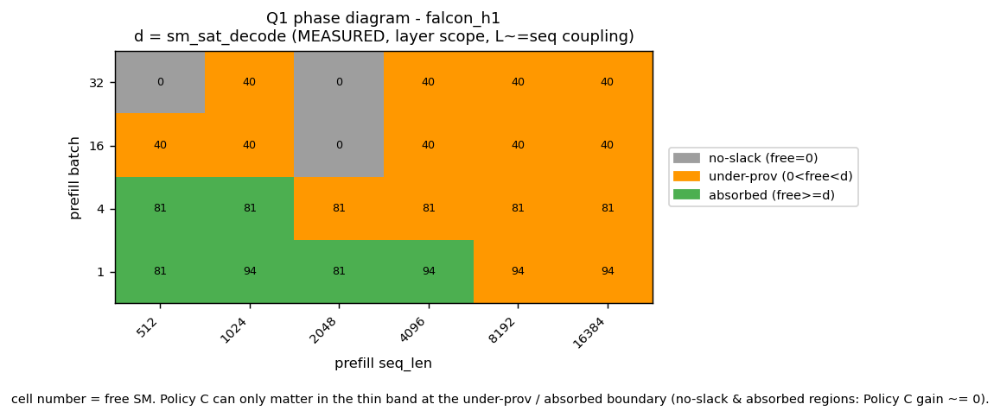
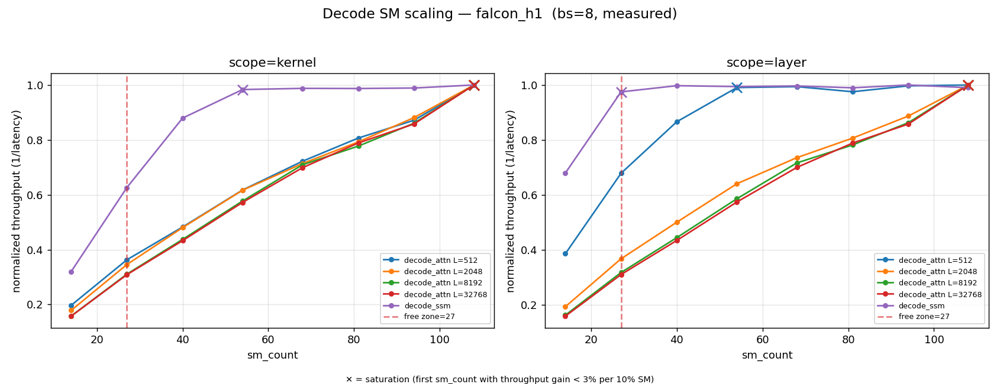
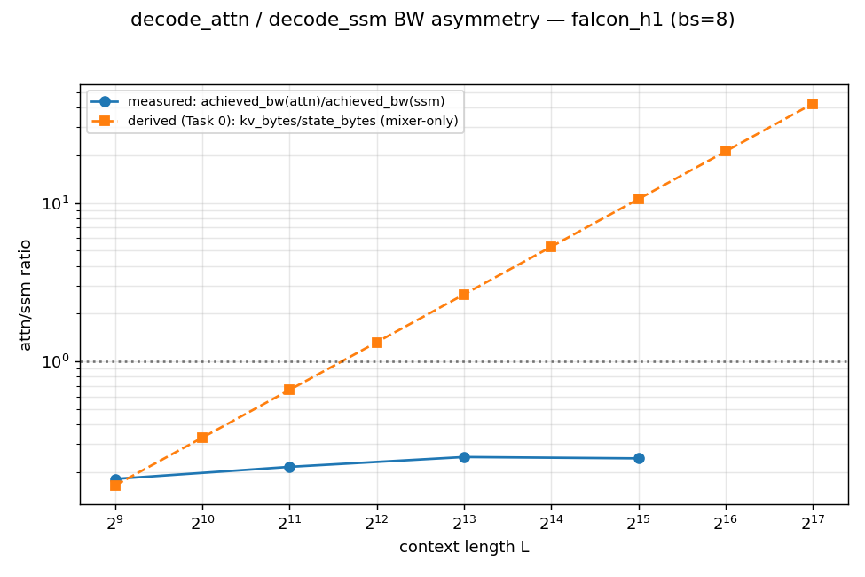

# Decode Saturation & KV/Weight Crossover

모든 수치에 **measured** / **derived** 라벨을 명시한다. 미측정 칸은 비워두고 `미측정` 으로 표기한다. 보간·합성값 없음.

- 측정 환경: A100-SXM4-80GB (108 SM, HBM2e 2000 GB/s)
- saturation 기준: throughput(∝1/latency) marginal gain < 3% per 10% SM (Stage 1 과 동일)

## zamba2  (free zone = 14 SM @ 단일 operating point — 판정 1b 곡면 참조)

### 판정 1 — Q1 (Policy C 생사), 단일점 기준

대표 serving config: layer scope, bs=8, L=8192 (decode_attn) / L=0 (decode_ssm).

> ⚠️ 아래 free_zone=14 은 **단일 operating point 상수**다. free zone 은 실제로 (batch, seq_len) 에 따라 0–94 SM 로 변하므로, Q1 의 결정적 판정은 **판정 1b (phase diagram)** 를 따른다.

| cell | sm_sat_decode (derived) | free_zone (단일점) | 판정 (단일점, 참고용) |
|------|------|------|------|
| decode_ssm | 40 | 14 | NOT absorbed — decode가 free zone보다 26 SM 더 요구; 잔여 이득 상한 ≈ 26 SM (sm_sat=40 > 14) |
| decode_attn | 68 | 14 | NOT absorbed — decode가 free zone보다 54 SM 더 요구; 잔여 이득 상한 ≈ 54 SM (sm_sat=68 > 14) |

### 판정 1b — free zone 곡면 + Q1 phase diagram (measured)

**핵심 정정:** 판정 1의 free_zone 상수는 단일 operating point 값이다. 정정된 Stage 1 chunked latency 로 재계산하면 free zone 은 (prefill batch, seq_len) 에 따라 **0–94 SM** 로 변한다 (measured; 108 − SSM prefill saturation_sm).
- 판정 1이 쓴 상수 free_zone=14 가 나오는 cell: (bs16, seq512) → 그 한 점에만 해당하는 값임.

free zone 곡면 (measured, 108 − saturation_sm):

| bs \\ seq | 512 | 1024 | 2048 | 4096 | 8192 | 16384 |
|---|---|---|---|---|---|---|
| **32** | 0 | 0 | 0 | 0 | 0 | 0 |
| **16** | 14 | 40 | 0 | 0 | 0 | 0 |
| **4** | 40 | 81 | 81 | 81 | 81 | 81 |
| **1** | 81 | 94 | 81 | 81 | 81 | 81 |

Q1 regime — d = measured sm_sat_decode (layer scope, L≈seq); 셀 = `regime(free,d)`:

| bs \\ seq | 512 | 1024 | 2048 | 4096 | 8192 | 16384 |
|---|---|---|---|---|---|---|
| **32** | void (f0/d108) | void (f0/d108) | void (f0/d108) | void (f0/d108) | void (f0/d108) | void (f0/d108) |
| **16** | under (f14/d108) | under (f40/d108) | void (f0/d108) | void (f0/d108) | void (f0/d108) | void (f0/d108) |
| **4** | under (f40/d68) | absorb (f81/d68) | absorb (f81/d81) | absorb (f81/d81) | absorb (f81/d81) | absorb (f81/d81) |
| **1** | absorb (f81/d27) | absorb (f94/d27) | absorb (f81/d40) | absorb (f81/d40) | absorb (f81/d68) | absorb (f81/d68) |

regime 집계 (measured): absorbed=11, under-prov=3, no-slack=10  (총 24 cells)

**결론 (Q1):** free zone 과 decode 수요-부족은 batch 축에서 **역상관**이다 — 여유가 큰 저-batch 에선 decode 가 free zone 에 흡수되어 (absorbed) Policy C 이득 ≈ 0, decode 가 더 요구하는 고-batch 에선 free zone = 0 (no-slack) 이라 멀티플렉싱 여유 자체가 없다. Policy C 가 fixed split 대비 차이를 낼 수 있는 구간은 under-prov 셀 3/24 의 좁은 띠로 한정된다. 따라서 단일 free_zone 상수에 기반한 "잔여 이득 상한" 수치(판정 1)는 operating point 평균을 호도하므로, 아래 phase diagram 의 region 해석으로 대체한다.

### 판정 2 — Q3 가정 (a) (decode 행 BW 분리)

measured achieved_bw(decode_attn,kernel)/achieved_bw(decode_ssm,kernel) vs L, bs=8 — Task 0 derived (kv/state) 곡선과 overlay.

| L | achieved_bw_attn (measured, GB/s) | achieved_bw_ssm (measured, GB/s) | ratio measured | ratio derived (Task 0) |
|---|---|---|---|---|
| 512 | 895.3 | 170.9 | 5.240 | 7.749 |
| 2048 | 992.4 | 170.9 | 5.808 | 30.997 |
| 8192 | 1019.7 | 170.9 | 5.968 | 123.987 |
| 32768 | 1027.6 | 170.9 | 6.014 | 495.948 |

> measured ratio 가 derived ratio 의 추세(L 증가 시 단조 증가)를 따르면 분석 모델(가정 a) 신뢰. 큰 괴리는 모델 재검토 필요.

### Sanity (measured)

- decode_ssm kernel sm=108 bs=8: latency=85.92 us (measured) — Stage 1 decode 참조치와 자릿수 비교용
- Stage 1 ssm_chunked reference loaded (768 rows) — decode 자릿수 sanity 참조 (prefill seq_len=1 기준)
- status 분포 (measured): ok=400, OOM=0, CUDA_ERROR=0 — CUDA_ERROR 행이 후속 행을 오염시키지 않음(서브프로세스 격리)
- decode_attn kernel sm=108 bs=1: latency monotonic in L = True (measured)

## falcon_h1  (free zone = 27 SM @ 단일 operating point — 판정 1b 곡면 참조)

### 판정 1 — Q1 (Policy C 생사), 단일점 기준

대표 serving config: layer scope, bs=8, L=8192 (decode_attn) / L=0 (decode_ssm).

> ⚠️ 아래 free_zone=27 은 **단일 operating point 상수**다. free zone 은 실제로 (batch, seq_len) 에 따라 0–94 SM 로 변하므로, Q1 의 결정적 판정은 **판정 1b (phase diagram)** 를 따른다.

| cell | sm_sat_decode (derived) | free_zone (단일점) | 판정 (단일점, 참고용) |
|------|------|------|------|
| decode_ssm | 27 | 27 | absorbed — fixed split이 free zone(27)을 흡수, layer-wise 추가 이득 상한 ≈ 0 (sm_sat=27 ≤ 27) |
| decode_attn | 108 | 27 | NOT absorbed — decode가 free zone보다 81 SM 더 요구; 잔여 이득 상한 ≈ 81 SM (sm_sat=108 > 27) |

### 판정 1b — free zone 곡면 + Q1 phase diagram (measured)

**핵심 정정:** 판정 1의 free_zone 상수는 단일 operating point 값이다. 정정된 Stage 1 chunked latency 로 재계산하면 free zone 은 (prefill batch, seq_len) 에 따라 **0–94 SM** 로 변한다 (measured; 108 − SSM prefill saturation_sm).
- 판정 1이 쓴 상수 free_zone=27 가 나오는 cell: 측정 격자 내 없음 → 그 한 점에만 해당하는 값임.

free zone 곡면 (measured, 108 − saturation_sm):

| bs \\ seq | 512 | 1024 | 2048 | 4096 | 8192 | 16384 |
|---|---|---|---|---|---|---|
| **32** | 0 | 40 | 0 | 40 | 40 | 40 |
| **16** | 40 | 40 | 0 | 40 | 40 | 40 |
| **4** | 81 | 81 | 81 | 81 | 81 | 81 |
| **1** | 81 | 94 | 81 | 94 | 94 | 94 |

Q1 regime — d = measured sm_sat_decode (layer scope, L≈seq); 셀 = `regime(free,d)`:

| bs \\ seq | 512 | 1024 | 2048 | 4096 | 8192 | 16384 |
|---|---|---|---|---|---|---|
| **32** | void (f0/d108) | under (f40/d108) | void (f0/d108) | under (f40/d108) | under (f40/d108) | under (f40/d108) |
| **16** | under (f40/d108) | under (f40/d108) | void (f0/d108) | under (f40/d108) | under (f40/d108) | under (f40/d108) |
| **4** | absorb (f81/d27) | absorb (f81/d27) | under (f81/d108) | under (f81/d108) | under (f81/d108) | under (f81/d108) |
| **1** | absorb (f81/d14) | absorb (f94/d14) | absorb (f81/d27) | absorb (f94/d27) | under (f94/d108) | under (f94/d108) |

regime 집계 (measured): absorbed=6, under-prov=15, no-slack=3  (총 24 cells)

**결론 (Q1):** free zone 과 decode 수요-부족은 batch 축에서 **역상관**이다 — 여유가 큰 저-batch 에선 decode 가 free zone 에 흡수되어 (absorbed) Policy C 이득 ≈ 0, decode 가 더 요구하는 고-batch 에선 free zone = 0 (no-slack) 이라 멀티플렉싱 여유 자체가 없다. Policy C 가 fixed split 대비 차이를 낼 수 있는 구간은 under-prov 셀 15/24 의 좁은 띠로 한정된다. 따라서 단일 free_zone 상수에 기반한 "잔여 이득 상한" 수치(판정 1)는 operating point 평균을 호도하므로, 아래 phase diagram 의 region 해석으로 대체한다.

### 판정 2 — Q3 가정 (a) (decode 행 BW 분리)

measured achieved_bw(decode_attn,kernel)/achieved_bw(decode_ssm,kernel) vs L, bs=8 — Task 0 derived (kv/state) 곡선과 overlay.

| L | achieved_bw_attn (measured, GB/s) | achieved_bw_ssm (measured, GB/s) | ratio measured | ratio derived (Task 0) |
|---|---|---|---|---|
| 512 | 54.0 | 297.9 | 0.181 | 0.165 |
| 2048 | 64.4 | 297.9 | 0.216 | 0.661 |
| 8192 | 74.2 | 297.9 | 0.249 | 2.643 |
| 32768 | 72.8 | 297.9 | 0.244 | 10.570 |

> measured ratio 가 derived ratio 의 추세(L 증가 시 단조 증가)를 따르면 분석 모델(가정 a) 신뢰. 큰 괴리는 모델 재검토 필요.

### Sanity (measured)

- decode_ssm kernel sm=108 bs=8: latency=84.46 us (measured) — Stage 1 decode 참조치와 자릿수 비교용
- Stage 1 ssm_chunked reference loaded (768 rows) — decode 자릿수 sanity 참조 (prefill seq_len=1 기준)
- status 분포 (measured): ok=400, OOM=0, CUDA_ERROR=0 — CUDA_ERROR 행이 후속 행을 오염시키지 않음(서브프로세스 격리)
- decode_attn kernel sm=108 bs=1: latency monotonic in L = True (measured)

