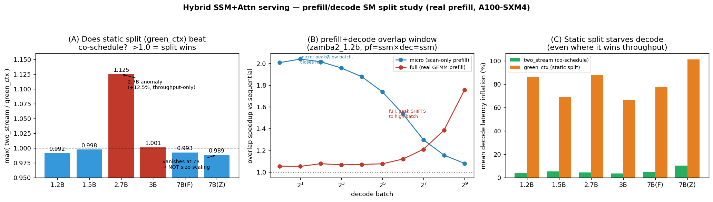

# 실험 도식 — Hybrid SSM+Attention serving SM-분할 연구 (전체 흐름)

작성일: 2026-06-18 · 대상: prefill-layer-alloc (Zamba2 1.2/2.7/7B, Falcon-H1 1.5/3/7B, Nemotron-H 8B · A100-SXM4-80GB)
용도: v1→v2→widened→real-prefill→7B로 이어진 실험 전체를 한 장으로 설명. 정량 요약은 아래 그림, 논리·흐름은 §1–§3.


*그림: (A) 정적분할(green_ctx)이 동시실행(two_stream)을 이기는가 — 2.7B에서만 +12.5% 예외, 7B서 소멸(크기-스케일링 아님). (B) overlap window — micro(scan-only)는 저배치 ~2×→닫힘, real prefill은 봉우리가 고배치로 이동(반전). (C) green_ctx는 처리량을 이기는 곳조차 decode 지연을 66–101% 악화.*

---

## 1. 측정 파이프라인 (DAG) — 무엇을 묻고 무엇이 나왔나

```
 [GPU-free]                        ┌──────── 게이트 (사람 최종판정) ────────┐
  E0  analytic grid ──────────────▶│                                        │
   │  "batch↑서 grid가 SM 포화?"    │                                        │
   ▼                                ▼                                        ▼
  E1  prefill 분해 ───▶ G0:scan≥30%? ──OK(62–74%)──▶ E2 SM-sat sweep ──▶ G1:attn-ssm 비대칭?
                          │                                                  │ PRESENT(13–54SM)
                          │                                          ┌───────┘ ※ 후에 "잘못된 술어"로 판명(§2)
                          ▼                                          ▼
                    E3 decode floor                            E4 concurrent A/B
                    "자유 SM 있나?"                            "분할로 회수되나?"
                    저배치 有→고배치 108포화                   aware split이 decode 굶김(+60–144%)
                          └───────────────┬──────────────────────────┘
                                          ▼
                       E5  serving prefill×decode 매트릭스  ◀── 핵심
                       backend: sequential / two_stream(동적공유) / green_ctx(정적분할)
                                          │
                  ┌───────────────────────┼───────────────────────────┐
                  ▼                        ▼                            ▼
           widened {1..512}        real-prefill (full)            7B 회귀 (Path 1)
           microbench 확인          GEMM-inclusive·16chunk          zamba2_7b·falcon_h1_7b
           green_ctx 못이김         job 775529                      job 776326
           window 고배치서 닫힘      → 결론 2개 정정(§3)             → 분할 예외 소멸(§3)
```

| 단계 | 질문 | 결과 | 함의 |
|---|---|---|---|
| **E0** | grid가 batch↑서 SM 포화? | batch≥8 초과 | grid면 비대칭 죽는다(사전예측) |
| **E1/G0** | scan이 유의미 component? | OK peak 62–74% (고batch 20–40%) | 분할 동기는 저batch 한정 |
| **E2/G1** | attn-ssm sat_sm 비대칭? | PRESENT 13–54SM | **단 술어 오류·granularity 의존(§2)** |
| **E3** | decode가 자유 SM 남기나? | 저배치 有 → 고배치 floor→108 | overlap 방은 저배치만 |
| **E4** | 비대칭을 분할로 회수? | aware split이 decode 굶김 | 분할은 손해 |
| **E5** | 분할이 동시실행 이기나? | microbench: 의미있는 승리 0 | 가설 기각 |
| **widened** | b512까지도? | green_ctx 노이즈 동률뿐, window 닫힘 | 확인(단 microbench) |
| **real-prefill** | 진짜 GEMM prefill서도? | **overlap 2×=artifact(window 반전); 2.7b 분할 +12.5%(throughput)** | 결론 2개 정정 |
| **7B** | 분할 이득이 크기와 함께 커지나? | **아니오 — 7B서 예외 소멸** | "큰 커널" 구멍 음성으로 닫힘 |

---

## 2. 개념 도식 — 왜 분할은 죽고, 진짜 축은 어디인가

```
                       Hybrid SSM+Attention serving
                                  │
        ┌──────────────────────────┴──────────────────────────┐
   축1: attn ↔ ssm                                  축2: prefill ↔ decode
   (같은 forward pass의 부분단계)                     (별개 요청)
        │                                                  │
   "layer-type로 SM 분할해 활용?"                     "겹쳐서(co-schedule) 이득?"
        │                                                  │
   ✗ 구조적 DEAD                                      △ 실재하나 GENERIC
   • 독립단위 X · 병목상보성 X        (§3 본문)         • overlap 실재(~2×) 단 microbench 산물
   • sat_sm 비대칭 = lever 아님       (§3.1 술어오류)    • real prefill: 봉우리가 고배치로 이동
   • compute분할 ⊥ memory분할         (§3.2)            • prefill/decode 분할은 MuxWise·Bullet
   • 7B서도 분할 음성 확정            (real_prefill §7)    (ASPLOS'26) 영역 — SLO·대형서 이득
        │                                                  │
        └────────────► 진짜 abstraction은 "한 층 아래" ◄─────┘
                    축3: memory-state 구조
                    KV = O(L) (위치-인덱싱, append)  vs  SSM state = O(1) (folded)
                    = 유일하게 abstraction-worthy한 신규 축 (Path 5, 별개 프로젝트)
```

핵심 논리 사슬: **실행(execution) 비대칭은 *증상*이고 원인은 *memory-state 구조*다.** compute 손잡이(Green Context=SM만 분할; HBM/L2 공유)로는 memory 분리에 닿지 못하므로(§3.2), 분할로는 이득을 살 수 없다. 유일한 양성(overlap)조차 그 *흥미로운 구조*(dec=ssm의 long-context 평탄성)는 O(1) state라는 memory 성질이 설명한다.

---

## 3. 정정된 두 결론 (real-prefill + 7B로 실측)

```
 ┌─ 결론 ① overlap ───────────────────────────────────────────────────────────┐
 │ v2:       "co-schedule이 ~2× 공짜, window는 decode batch↑서 닫힌다"          │
 │ 정정:     ~2×는 microbench(작은 scan prefill) 산물. real prefill(8.5ms)에선  │
 │           저배치 1.05×로 붕괴, 봉우리가 고배치로 이동(db512 1.6–1.87×).      │
 │           ⇒ window는 닫히는 게 아니라 *열린다*. 메커니즘 = duration matching │
 └─────────────────────────────────────────────────────────────────────────────┘
 ┌─ 결론 ② partition ─────────────────────────────────────────────────────────┐
 │ v2:       "분할은 어떤 셀도 동시실행을 못 이긴다(무용)"                       │
 │ 정정:     SLM·microbench·throughput 한정. real prefill·zamba2_2.7b서 균형    │
 │           분할이 +12.5% (단 decode 80% 희생=SLO론 패). 그러나 7B서 예외 소멸 │
 │           ⇒ 분할 이득은 *크기-스케일링 아님*. "SLO 기준 분할 불리"로 재정의 시 │
 │              real prefill·7B에서도 유지. 남은 가능성=목적함수(SLO)+decode보호 │
 │              분할(검수 A5)뿐 — 크기 축은 닫힘.                                │
 └─────────────────────────────────────────────────────────────────────────────┘
```

**한 줄:** *layer-type 공간 SM 분할 thesis는 메커니즘(§3.1·§3.2)으로도 7B 실측으로도 닫혔다. serving 이득은 분할이 아니라 (a) duration-matched co-schedule(overlap), (b) — 진짜 신규 축이라면 — memory-state 추상화(Path 5)에서 온다.*

---

## 산출물 맵
- 정량 요약 그림: `results_v2/figures/study_summary.png` (위)
- 단계별 그림 21종: `results_v2/figures/*.png` (e0~e5)
- 보고서: [closure](project_closure_report.md) · [real_prefill_results](real_prefill_results.md) · [widened_sweep_validation](widened_sweep_validation.md) · [additional_value_paths](additional_value_paths.md) · [review_checklist](review_checklist.md) · 설계 [real_prefill_experiment_design](real_prefill_experiment_design.md)
- 중심 문서: `workspace/characterization/reports/v2_report.md`
