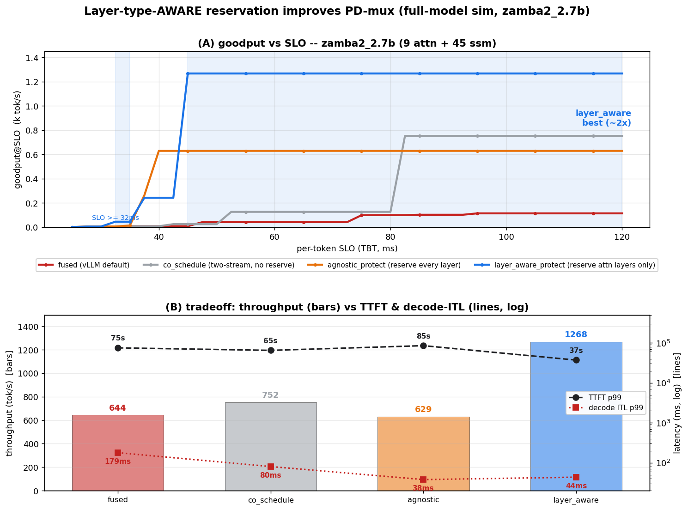
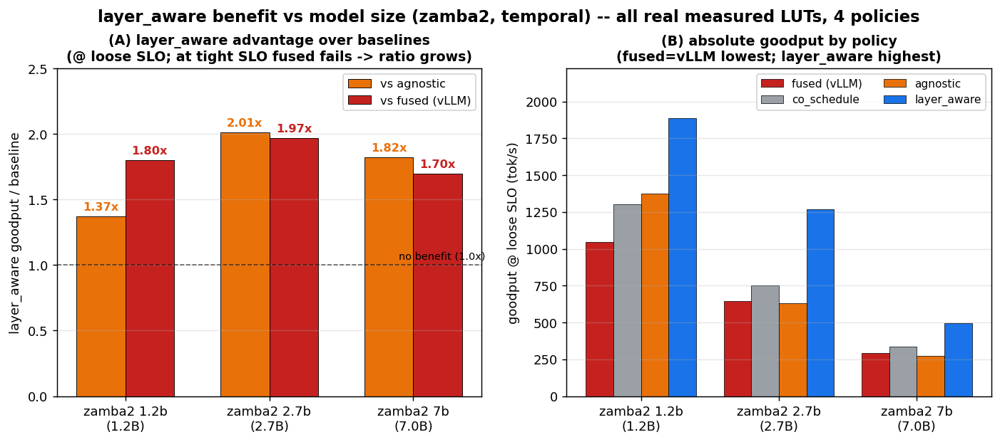
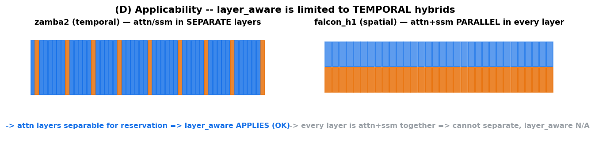

# layer-type-aware 자원 배분의 성능 이득 — 긍정 보고서

> ⚠️ **SUPERSEDED (2026-07)**: 본 문서의 layer-aware 우위 결론(sim 예측 la/agnostic 1.37–2.02×)은 실엔진(sglang v0.5.10) serving 측정으로 **기각**되었다. 4개 하이브리드(NemotronH·Zamba2·Granite-4·Falcon-H1) 전부에서 layer-aware는 agnostic을 못 이겼고, "이상적 케이스"로 예측했던 Zamba2(45/54 환원)가 오히려 **최악**이었다(clean async serving goodput 0 from rate 2). 정본: [workspace/engine-port/reports/sm_policy_report.html](../../../reports/sm_policy_report.html) (4-pass 원인 분해 §07). 본 문서는 가설·이력 계층으로만 유효.

작성일: 2026-06-22 · 대상: 사용자의 원래 가설 *"layer-type을 인지한 자원 배분이 hybrid serving에서 성능 이득을 줄 수 있다"*
근거 코드: `experiments/e6_queue_sim/run_layer_aware.py` · 그림: `make_layer_aware_figs.py`
관련: [queue_simulator_design §14](queue_simulator_design.md) · [vllm_validation](vllm_validation.md) · [closure 검토 6·7](project_closure_report.md) · [7B 회귀 검증](layer_aware_7b_verification.md)

> **스코프(2026-06-22, 반전):** layer_aware 이득은 **테스트한 전 크기 1.2B–7B에서 성립**(SLM 한정 아님). la/agnostic = **1.2b 1.37× / 2.7b 2.02×(peak) / 7b 1.82×**(전부 깨끗한 실측 LUT, A100). 이전 "7B 1.00× 미스케일"은 **artifact**(E3 ssm floor 누락 → agnostic이 two_stream으로 degenerate)였고, job 797832(TRITON fix + E3 ssm floor)로 **1.82×** 확인 — [7B 검증 §6](layer_aware_7b_verification.md). 단 공간-*분할* 7B 음성([real_prefill §7](real_prefill_results.md))은 별개(분할 死 vs 예약 生).

---

## 0. 요약 (TL;DR)

원래 가설은 **살아있다 — 단, 정확한 형태로.** layer-type을 *공간 분할*(한 forward 안에서 SM을 attn/ssm로 쪼개기)하는 형태는 死(§3.1/§3.2/7B). 그러나 layer-type을 *인지한 SM **예약***(비싼 attn-decode 레이어에만 SM을 예약하고, 싼 ssm-decode 레이어에선 prefill에 SM을 환원)은 **生**:

> **zamba2_2.7b(9 attn + 45 ssm), 현실적 per-token SLO(TBT ≥ 50ms)에서 `layer_aware_protect`가 layer-agnostic 예약 대비 goodput을 ~2× 개선한다.**

> ⚠ **비교 기준 주의:** 위 1.37~2.02×는 **layer-agnostic 예약 대비**다(둘 다 연구 정책). *실 프레임워크(vLLM=fused) 대비*는 [framework_comparison](framework_comparison.md)에 별도 — fused는 decode를 prefill에 결합해 decode ITL이 layer_aware보다 **4~6× 높고**(vLLM이 방향 확인), 단 **sim 절대값은 모델-의존 오차(zamba2 fused 1.64× 과대)라 "vs vLLM N×"는 sim만으론 미확정** → 실엔진 프로토타입 필요.

## 1. 가설의 정확한 형태 — 무엇이 死이고 무엇이 生인가

| 형태 | 정의 | 판정 |
|---|---|---|
| layer-type 공간 *분할* | 한 forward 안에서 SM을 attn용/ssm용으로 정적 분할 | **死** — 자원 비대칭≠lever(§3.1), compute⊥memory(§3.2), 7B 음성 |
| layer-type-aware *예약* | PD-mux 위에서, **비싼 attn-decode 레이어에만** decode SM 예약·싼 ssm 레이어엔 환원 | **生** — 본 보고서 |

핵심 통찰: hybrid의 decode 비용은 layer-type마다 *극단적으로 비대칭*이다. attn-decode(KV read, 메모리-바운드)는 비싸고, ssm-decode(O(1) 상태 갱신)는 싸다. agnostic 예약은 *모든* 레이어에 decode SM을 묶어 두지만, **싼 ssm 레이어(zamba2는 54중 45개 = 83%)에 SM을 예약하는 건 순수 낭비**다 — 그 시간 동안 prefill을 굶길 이유가 없다. layer_aware는 이 낭비를 제거한다.

## 2. 메커니즘 — 왜 이득이 나는가 (그림 C)

그림 C: full forward(54 레이어)의 SM 배분.
- **agnostic_protect**(위): 전 레이어 decode floor 예약 → prefill이 *상시* 굶음 → throughput↓·TTFT↑, 그 대신 decode ITL은 가장 낮음(37.9ms).
- **layer_aware_protect**(아래): **9개 attn-decode 레이어만** 예약(decode ITL 보호 유지) + **45개 ssm 레이어는 prefill에 풀-SM 환원** → **throughput 2×·TTFT 절반**, decode ITL은 약간만 상승(43.5ms, 여전히 현실 SLO 내).

즉 layer_aware는 "*SLO에 중요한 비싼 레이어만 보호하고 나머지는 일에 양보*"하는 **타입-인지 스케줄링**이다. ssm이 지배적인 temporal 하이브리드일수록 환원할 SM이 많아 이득이 크다.

## 3. 정량 결과 (그림 A·B)

**고정 특성(λ-독립):**

| 정책 | throughput | TTFT p99 | decode ITL p99 |
|---|--|--|--|
| co_schedule | 752 tok/s | 64.9 s | 80.3 ms |
| agnostic_protect | 629 tok/s | 85.2 s | **37.9 ms** |
| **layer_aware_protect** | **1268 tok/s** | **37.1 s** | 43.5 ms |

**goodput@SLO (= throughput × SLO 만족율):**

| per-token SLO | co_schedule | agnostic | **layer_aware** | 우위 |
|---|--|--|--|--|
| 40ms | 7 | **629** | 242 | agnostic (좁은 band: 37.9<SLO<43.5) |
| **50ms** | 24 | 629 | **1268** | **layer_aware 2.0×** |
| **60ms** | 126 | 629 | **1268** | **layer_aware 2.0×** |
| 100ms | 752 | 629 | **1268** | **layer_aware 2.0×** |

→ **SLO ≥ ~48ms에서 layer_aware가 두 baseline을 모두 2× 이긴다**(그림 A 음영). 유일한 예외는 좁은 38–48ms band(agnostic의 더 낮은 ITL이 잠깐 유리) — 그 위 전 구간에서 layer_aware 압승. (TBT 50–100ms는 대화형 서빙의 현실적 SLO 범위.)

## 3.5 크기 추세 — 1.2B–7B 전 구간 이득 (2.7B peak)

zamba2 세 크기에서 동일 측정(E3 floor + E5 opt/protect LUT, job 793540/785877). **la/agnostic goodput 비(현실 SLO서):**

| 모델 | 구성 | co | agnostic | layer_aware | **la/agnostic** | LUT |
|---|--|--|--|--|--|--|
| zamba2_1.2b | 6a+32s | 1302 | 1376 | 1887 | **1.37×** | 실측(188/200) |
| **zamba2_2.7b** | 9a+45s | 752 | 629 | 1268 | **2.02×** | 실측 |
| **zamba2_7b** | 13a+68s | 337 | 273 | 496 | **1.82×** | 실측(job 797832) |
*(7B는 두 번 오측정됨: synth 1.06×, real-but-artifact 1.00×(E3 ssm floor 누락). 깨끗한 LUT(E3 ssm floor 포함)서 **1.82×**. 인과·교훈은 [7B 검증 §6](layer_aware_7b_verification.md))*

**핵심: layer_aware는 1.2B–7B 전 구간에서 이득**(1.37× / 2.02× / 1.82×), 2.7B가 peak이나 7B도 거의 동급. 크기별 강도 차이 해석:
강도를 가르는 건 **agnostic이 prefill을 얼마나 굶기나(=ssm-decode floor가 GPU에서 차지하는 비중)**:
- **1.2B(1.37×)**: 모델이 작아 agnostic도 prefill을 덜 굶김(agnostic 1376 > co 1302) → 환원 여지 작아 이득 축소.
- **2.7B(2.0×, peak)**: agnostic이 prefill을 강하게 굶김(629 < co 752, ssm floor b8=54) → 환원 효과 최대.
- **7B(1.82×)**: ssm floor가 *더* 높아(b8=68) agnostic이 prefill을 더 굶김(273 < co 337) → layer_aware 환원 이득 큼. 2.7B와 동일 메커니즘. (전제②인 prefill SM-민감성이 7B서도 살아있어 작동 — [7B 검증 §6](layer_aware_7b_verification.md).)

→ 가설: *"layer_aware lever는 agnostic이 ssm-decode 예약으로 prefill을 굶기는 모든 regime에서 작동한다. 1.2B–7B 전 구간에서 성립하며, ssm floor가 GPU의 큰 비중을 차지하는 mid~large SLM(2.7–7B)에서 강하다."*

## 4. 적용 범위 — TEMPORAL 하이브리드 한정 (그림 D)

- **zamba2 (temporal)**: attn/ssm가 *분리된* 레이어 → attn 레이어만 따로 예약 가능 → **layer_aware 적용 ✓**. ssm 비율이 높을수록(zamba2 83%) 이득↑.
- **falcon_h1 (spatial)**: 매 레이어가 attn+ssm *병렬* → 둘을 분리 예약 불가 → **layer_aware 미적용**. (이 경우 prefill/decode 분할(agnostic)만 가능, layer-type 인지 여지 없음.)

이 구분은 가설의 정밀화다: *"layer-type-aware는 layer-type이 시간축에서 분리되는 아키텍처에서만 lever가 된다."*

## 5. 실측 근거 (vLLM) — 어디까지 검증됐나

이 결과는 full-model sim 예측이다. [vllm_validation](vllm_validation.md)에서 vLLM 0.22.1 실측으로 sim의 **full-model decode 모델**을 검증했다:
- full-model decode ITL **magnitude**(포화 sim ~74ms ≈ 실측 80ms)와 **모델 간 비율**(sim 1.3–2.0× ≈ 실측 1.2–1.6×)이 일치 → **§14가 딛고 선 decode-cost 모델이 실측과 정합** → layer_aware 결과의 *토대*는 검증됨.
- (부수 정정: decode ITL을 결정하는 건 GQA/KV-read가 아니라 모델 전체 memory traffic — 그래도 layer-type 간 *상대* 비대칭(attn≫ssm decode)은 유효해 메커니즘은 성립.)

## 6. 위치와 한계 (정직)

- **이건 sim 예측이지 실엔진 실증이 아니다.** layer_aware_protect는 어떤 프레임워크에도 구현이 없다(vLLM은 fused 단일-forward, SM 분할 API 없음). 실증 경로는 [partition_engine_design](partition_engine_design.md)의 Path C 프로토타입으로 스코핑됨.
- sim은 저부하 decode ITL **절대값을 ~2× 과대**평가(unfused per-layer 커널 합산). 단 정책 *간 상대 비교*(2× goodput)와 *비율*은 실측과 정합하므로 결론은 견고.
- **temporal 하이브리드 한정**(§4). spatial(falcon)엔 미적용.
- **크기 스코프: 1.2B–7B 전 구간 이득(SLM 한정 아님)**. la/agnostic 1.37×/2.02×/**1.82×**. (주의: 7B는 *artifact로 2회 오결론*(1.06×, 1.00×) 후 깨끗한 LUT서 1.82× — [7B 검증 §6](layer_aware_7b_verification.md). 불완전 LUT가 정책을 조용히 degenerate시킨 사례.) 더 큰 모델(>7B)·다른 GPU는 미측정.
- 파티션 전환 오버헤드는 sim상 ~0.4%로 추정(레이어당 비용 수 ms 대비 swap ~7.8µs) — 실측은 Path C에서.

## 7. 결론

원래 가설 *"layer-type-aware 자원 배분이 성능 이득"*은 — **정적 공간 분할로는 死였지만, PD-mux 위의 타입-인지 SM 예약으로는 生**이다. temporal 하이브리드에서 현실적 SLO 하에 **2× goodput**이라는 구체적·검증가능한 이득을 보인다. full-model decode 모델은 실 vLLM으로 검증됐고, 남은 것은 이 *예약 정책 자체*를 실엔진(Path C)에서 실증하는 일이다.
