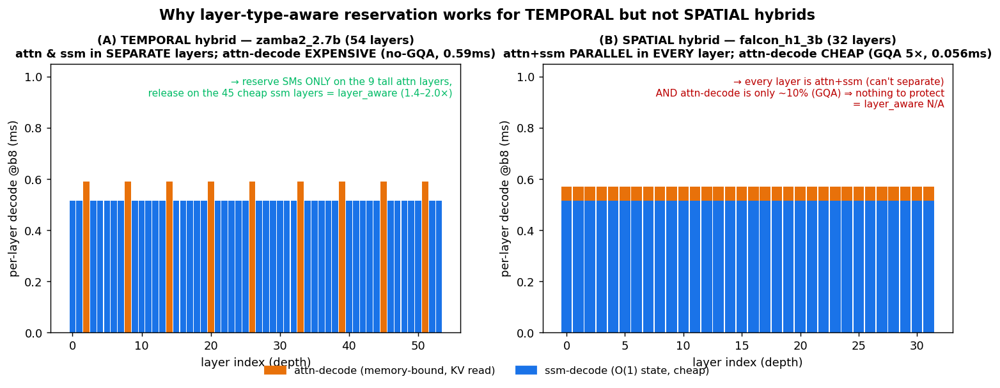

# Sequential(temporal) vs Parallel(spatial) 하이브리드 — 경향성 종합

작성일: 2026-06-22 · 대상: layer-type-aware 자원배분 논의를 **두 하이브리드 아키텍처 부류**에서 정리·대조.
관련: [layer_aware_benefit](layer_aware_benefit_report.md) · [7B 검증](layer_aware_7b_verification.md) · [vllm_validation](vllm_validation.md) · [metrics_and_load_dependence](metrics_and_load_dependence.md)

---

## 0. 두 아키텍처

| | **Sequential / TEMPORAL** | **Parallel / SPATIAL** |
|---|---|---|
| 예 | Zamba2 (1.2/2.7/7B) | Falcon-H1 (3/7B) |
| 레이어 구성 | attn 레이어 **또는** ssm 레이어 (깊이축에서 *분리*) | 매 레이어가 attn **+** ssm (*병렬*, 공유 proj) |
| attention | **GQA 없음**(q=kv heads, head_dim 160) → **KV 큼** | **GQA 5×**(q10/kv2, head_dim 128) → **KV 작음** |

## 1. 핵심 데이터 (per-layer decode @b8, full-model)

| | z1.2b | z2.7b | z7b | f3b | f7b |
|---|--|--|--|--|--|
| type | TEMP | TEMP | TEMP | SPAT | SPAT |
| layers | 38 | 54 | 81 | 32 | 44 |
| attn layers | 6 | 9 | 13 | **32(전부)** | **44(전부)** |
| **decode_attn/layer (ms)** | ~0.59 | 0.591 | 0.954 | **0.056** | **0.056** |
| decode_ssm/layer (ms) | 0.52 | 0.516 | 0.542 | 0.515 | 0.525 |
| attn-decode가 decode서 차지 | ~17% | 19% | 25% | **10%** | **10%** |
| PREFILL_total (ms) | 30.2 | 48.5 | 126.2 | 33.5 | 45.3 |
| DECODE_total (ms) | 18.8 | 28.5 | 49.3 | 18.3 | 25.5 |
| **DECODE/PREFILL** | **0.62** | **0.59** | **0.39** | **0.54** | **0.56** |
| **la/agnostic (layer_aware 이득)** | **1.37×** | **2.02×** | **1.82×** | **N/A** | **N/A** |

## 2. 핵심 결론 — layer-type-aware lever는 두 전제를 요구하고, 그게 아키텍처로 갈린다

layer_aware(비싼 attn-decode 레이어만 SM 예약, 싼 ssm 레이어는 prefill 환원)가 작동하려면 **둘 다** 필요:
1. **레이어-타입 분리(temporal)** — attn 레이어와 ssm 레이어를 *시간축에서 다르게 스케줄*할 수 있어야 함.
2. **비싼 소수 레이어-타입** — 보호할 가치가 있는 expensive attn-decode(no-GQA로 KV 큼).

| 전제 | TEMPORAL (Zamba2) | SPATIAL (Falcon-H1) |
|---|---|---|
| ① 레이어-타입 분리 | ✅ attn/ssm 분리 레이어 | ❌ 매 레이어 attn+ssm 병렬 → 분리 불가 |
| ② 비싼 attn-decode | ✅ no-GQA, 0.59~0.95ms | ❌ GQA 5×, 0.056ms (decode의 10%뿐) |
| **layer_aware 적용성** | ✅ **1.37~2.02× 이득** | ❌ **N/A** (전제 둘 다 부재) |

- **TEMPORAL**: 그림(A)처럼 *드물지만 비싼* attn-decode 스파이크(9~13개)가 *분리된* 레이어에 있어, 그 스파이크에만 SM을 예약하고 나머지 싼 ssm 레이어는 prefill에 환원 → lever 성립.
- **SPATIAL**: 그림(B)처럼 *매 레이어가 attn+ssm 병렬*이라 타입별로 다르게 스케줄할 수 없고(①), 게다가 GQA로 attn-decode가 싸서(②) 애초에 보호할 비싼 부분이 없다(decode의 10%). **layer-type을 *공간 분할*(한 레이어 안에서 attn↔ssm SM 쪼개기)하는 형태조차 무의미** — 그 분할은 이미 §3.1/§3.2에서 死.

> **아키텍처 공-설계(co-design) 관찰:** 두 부류는 *우연히* 갈리는 게 아니다. **temporal 하이브리드는 attention을 *드물게(few layers)* 쓰되 *full(no-GQA, 비쌈)*로**, **spatial 하이브리드는 attention을 *매 레이어* 쓰되 *GQA로 싸게*** 만든다. 즉 "attn을 어디에·얼마나 비싸게 둘 것인가"의 설계 선택이 곧 layer-type 스케줄링의 가치를 결정한다.

## 3. 부수 경향성

- **DECODE/PREFILL 비율:** Zamba2(temporal)는 크기↑서 *감소*(1.2b 0.62→7b 0.39) — prefill이 decode보다 빨리 커짐(레이어 수×큰 weight). Falcon(spatial)은 크기 무관 ~0.55. **두 부류 다 prefill이 decode보다 무겁다**(비율<1) → prefill을 빠르게 하는 lever(layer_aware)가 원리상 유효한 환경.
- **decode의 절대 비용:** spatial(falcon)은 attn-decode가 싸(GQA) decode_total이 작다(18~26ms). → decode가 덜 부담스러워 **fused/co_schedule로 충분**, PD-mux 보호의 필요성도 약함. [vllm_validation](vllm_validation.md)에서 falcon이 fused로 SLO 잘 맞춘 것과 일치.
- **temporal의 decode:** no-GQA attn-decode가 비싸(0.59~0.95ms) 소수 레이어에 몰려 있어, *그 레이어들만* 보호하는 layer_aware가 가치를 가진다.

## 4. 종합 — 한 표로

| 축 | TEMPORAL (Zamba2) | SPATIAL (Falcon-H1) |
|---|---|---|
| layer-type 공간 *분할*(forward 내 SM 쪼개기) | 死 (§3.1/§3.2/7B) | 死 (+ GQA로 더 무의미) |
| layer-type-aware *예약*(temporal 스케줄) | **生 1.37~2.02×** (1.2B~7B 전구간) | **N/A** (분리 불가) |
| prefill/decode *uniform* PD-mux (co/agnostic/fused) | 적용 가능(layer_aware가 상위호환) | 적용 가능하나 decode 싸서 fused로 충분 |
| 결정 요인 | attn=*드뭄+비쌈*(no-GQA) | attn=*어디나+쌈*(GQA) |

**한 줄:** *layer-type-aware 자원배분의 가치는 "attention을 드물게-비싸게 쓰는" **temporal(sequential) 하이브리드에 고유**하다. "attention을 어디서나-싸게(GQA) 쓰는" **spatial(parallel) 하이브리드에는 적용되지 않는다** — 분리할 타입도, 보호할 비싼 부분도 없기 때문.*
