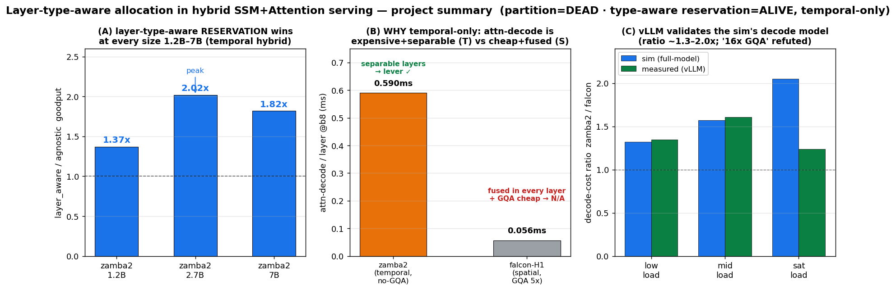

# 종합 보고서 — Hybrid SSM+Attention serving에서 layer-type-aware 자원배분

작성일: 2026-06-22 · 프로젝트: `prefill-layer-alloc` · GPU: A100-SXM4-80GB(108 SM)
대상 모델: Zamba2 1.2/2.7/7B (temporal 하이브리드) · Falcon-H1 3/7B (spatial 하이브리드)

> 이 문서는 전체 결론의 capstone이다. 세부는 하위 보고서로 링크: [layer_aware_benefit](layer_aware_benefit_report.md) · [7B 검증](layer_aware_7b_verification.md) · [temporal_vs_spatial](temporal_vs_spatial_hybrid.md) · [vllm_validation](vllm_validation.md) · [metrics_and_load_dependence](metrics_and_load_dependence.md) · [queue_simulator_design](queue_simulator_design.md) · [partition_engine_design](partition_engine_design.md)

---

## 0. 한 문단 요약

원래 가설("layer-type을 인지한 자원배분이 hybrid serving에서 이득")은 **형태를 정확히 하면 *살아있다*.** layer-type을 *공간 분할*(한 forward 안에서 SM을 attn/ssm로 쪼개기)하는 형태는 **死**. 그러나 PD-multiplexing 위에서 layer-type을 인지한 *SM 예약*(비싼 attn-decode 레이어에만 SM 예약, 싼 ssm 레이어는 prefill에 환원)은 **生 — temporal 하이브리드에서 layer-agnostic 예약 대비 goodput 1.37~2.02×**(zamba2 1.2B~7B 전 구간). 단 **spatial 하이브리드(Falcon-H1)에는 적용 불가**(레이어 분리 불가 + GQA로 attn-decode가 싸 보호 대상 없음). 모든 sim 결론의 *decode 모델*은 실 vLLM 서빙으로 검증했고, partition/예약 정책 자체의 실엔진 *실증*은 미완(프로토타입 스코핑됨).

## 1. 판정 지도 (무엇이 死이고 무엇이 生인가)

| 아이디어 | TEMPORAL (Zamba2) | SPATIAL (Falcon-H1) | 근거 |
|---|---|---|---|
| layer-type *공간 분할*(static, forward 내 SM 쪼개기) | **死** | **死**(+GQA로 더 무의미) | §3.1 비대칭≠lever · §3.2 compute⊥memory · 7B 음성 |
| layer-type-aware *예약*(PD-mux 위 타입별 예약) | **生 1.37~2.02×** | **N/A**(분리 불가) | run_layer_aware, [§benefit](layer_aware_benefit_report.md) |
| uniform PD-mux 보호(agnostic) vs fused | 조건부(layer_aware가 상위호환) | fused로 충분(decode 쌈) | [vllm_validation](vllm_validation.md) |

## 2. 살아있는 결과 — layer-type-aware 예약 (그림 A)

**메커니즘:** hybrid의 decode 비용은 타입별 극단 비대칭(attn-decode=메모리바운드 비쌈, ssm-decode=O(1) 쌈). `agnostic_protect`는 *모든* 레이어에 decode SM을 예약해 싼 ssm 레이어에서도 prefill을 굶긴다. `layer_aware_protect`는 **비싼 attn-decode 레이어만 보호하고 싼 ssm 레이어는 prefill에 SM 환원** → prefill throughput↑·TTFT↓, decode ITL은 SLO 내 유지.

**정량 (현실 per-token SLO, 깨끗한 실측 LUT):**

| 모델 | co_schedule | agnostic | **layer_aware** | la/agnostic |
|---|--|--|--|--|
| zamba2_1.2b | 1302 | 1376 | 1887 | **1.37×** |
| zamba2_2.7b | 752 | 629 | 1268 | **2.02×** |
| zamba2_7b | 337 | 273 | 496 | **1.82×** |

*(goodput tok/s. 전 크기에서 agnostic < co < layer_aware 또는 agnostic이 prefill 굶겨 손해 → layer_aware가 선택적 예약으로 역전. 1.2B~7B 전구간 이득 — "SLM 한정" 아님.)*

## 3. 적용 범위 — temporal-only (그림 B, [temporal_vs_spatial](temporal_vs_spatial_hybrid.md))

lever는 **두 전제**를 요구하고, 그게 아키텍처로 갈린다:
1. **레이어-타입 분리** — TEMPORAL ✅(attn/ssm 분리 레이어) / SPATIAL ❌(매 레이어 병렬).
2. **비싼 소수 attn-decode** — TEMPORAL ✅(no-GQA, 0.59~0.95ms) / SPATIAL ❌(GQA 5×, 0.056ms = decode의 10%).

**아키텍처 공-설계:** temporal은 attention을 *드물게+비싸게*(no-GQA), spatial은 *어디서나+싸게*(GQA) 쓴다. 이 설계 선택이 곧 layer-type 스케줄링의 가치를 결정 — 우연이 아니다.

## 4. 용어 — multiplexing vs reservation

- **PD-multiplexing = *방법***: 한 GPU에서 prefill+decode 동시 실행(↔ PD-disaggregation=별도 GPU). MuxWise/Bullet의 축.
- **reservation = 그 위의 *정책***: 공유 SM을 분할해 decode에 floor를 *보장*(Green Context). vs `co_schedule`(자유 공유, 예약 없음).

| 정책 | mux 형태 | 예약 |
|---|---|---|
| `fused`(vLLM 기본) | 시간적 fusion(1 커널에 prefill+decode) | — |
| `co_schedule` | 공간 mux(two_stream) | ✗ |
| `agnostic_protect` | 공간 mux(Green Context) | ✓ 전 레이어 |
| `layer_aware_protect` | 공간 mux(Green Context) | ✓ **attn 레이어만** |

→ **layer_aware = "공간 multiplexing으로 구현된, layer-type 인지 reservation 정책"**.

## 5. 부하 의존성 ([metrics_and_load_dependence](metrics_and_load_dependence.md))

- **모델 크기:** decode·protect 비용↑(7B attn-decode floor 68~108). la/agnostic은 1.2B 1.37→2.7B 2.02(peak)→7B 1.82 — agnostic이 prefill을 얼마나 굶기나(=ssm-decode floor 비중)가 강도를 가른다.
- **배치:** decode floor가 b16+서 108(전체)→고배치엔 보호 여지 소멸. GQA 비대칭은 배치↑서 확대(per-layer 1.7→21×)이나 full-model에선 ssm 지배로 희석.
- **시퀀스 길이:** attn-decode O(L)(KV∝ctx) vs ssm-decode O(1)(ctx 무관, BW~0.01%) — 하이브리드의 근본 비대칭.
- **DECODE/PREFILL 비율**(전 모델 <1, prefill-heavy): z1.2b 0.62·z2.7b 0.59·z7b 0.39·f3b 0.54·f7b 0.56.

## 6. 실 vLLM 검증 (그림 C, [vllm_validation](vllm_validation.md))

vLLM 0.22.1로 zamba2_2.7b·falcon_h1_3b 실제 서빙. **검증됨:** full-model decode ITL의 *모델 간 비율*(sim 1.3~2.0× ≈ 실측 1.2~1.6×)·포화 magnitude·TTFT 큐동역학. **반증됨:** "GQA가 이득구간 폭을 16× 가른다"(per-attn-layer artifact였음) — full-model decode는 ssm 지배로 ~1.3×. **단 partition/layer_aware는 어떤 프레임워크에도 없어 *fused baseline의 현실성*만 검증**됨.

**프레임워크 4-way 비교 보완**([framework_comparison](framework_comparison.md)): 비교군에 **fused(=vLLM 실baseline)를 추가**(이전엔 빠져 헤드라인이 agnostic 대비였음). fused는 decode를 prefill에 결합해 decode ITL이 layer_aware보다 **4~6× 높다**(vLLM이 TPOT 12→80ms 팽창으로 방향 확인). **단 sim 절대 calibration은 모델-의존**(zamba2 fused ITL 1.64× 과대·thru 0.8× 과소; falcon 1.09× 양호) → **"layer_aware vs vLLM N× goodput"의 *정량* 주장은 sim만으론 불가, 실엔진 프로토타입(§8) 선결.** 비교군 매핑: deployed는 fused뿐, co/agnostic/layer_aware는 연구 설계.

## 7. 방법론적 여정 & 교훈 (정직)

이 프로젝트의 결론은 여러 번 뒤집혔다 — 그 자체가 결과의 신뢰성에 대한 메타-데이터다:
- **PD-mux 판정 6회 반전**: baseline(two_stream→fused)·metric(throughput→goodput@SLO)·커널(vanilla→flash)·decoupling 가정에 병적 민감.
- **7B 판정 3회 반전**: synth 1.06× → "확정" 1.00×(artifact) → **1.82×(진짜)**. 원인은 **불완전 LUT가 정책을 *조용히* degenerate**(decode_ssm Triton-캐시 OSError→E3 ssm floor 누락→green_ctx_protect 폴백→agnostic≡layer_aware). 교훈: **결론 전 (a)셀단위 완전성, (b)두 정책이 실제로 다른 셀을 쓰는지 검증.** 1.2B/2.7B는 재검증으로 깨끗 확인.
- **GQA "16×" 반증·prefill"무감각" 반증·"decode-bound" 오설명** 등 중간 결론 다수가 더 정밀한 측정으로 정정됨.

## 8. 남은 gap & 다음 단계

- **실엔진 실증(최대 gap):** partition/layer_aware는 vLLM(fused 단일-forward, SM분할 API 없음)에 구현 불가 → 직접 비교 불가. [Path C 프로토타입](partition_engine_design.md)(레포 green-ctx 커널 재사용, ~5 GPU-일) 스코핑됨, 구현 보류.
- **확장:** >7B·다른 GPU·nemotron_h 등 타 temporal 하이브리드 미측정.
- **spatial 하이브리드:** layer-type lever 없음이 확정 → 별도 연구축(uniform PD-mux/fused)이며 본 thesis 밖.

## 9. 그림 색인 (`reports/figures/`)

| 그림 | 내용 |
|---|---|
| `summary_dashboard.png` | 본 종합(크기추세·temporal/spatial 판별자·vLLM 검증) |
| `layer_aware_result.png` | goodput-vs-SLO·tradeoff·메커니즘(54레이어 SM배분) |
| `layer_aware_size_trend.png` | la/agnostic 1.2/2.7/7B(전부 실측) |
| `temporal_vs_spatial.png` | 두 아키텍처 per-layer decode 구조 |
| `prefill_sm_sensitivity.png` | prefill SM-민감도 크기 불변(7B도 민감) |
| `layer_aware_applicability.png` | temporal 적용/spatial N/A |

## 10. 한 줄 결론

> **layer-type-aware 자원배분은 — 정적 공간분할로는 死지만, PD-multiplexing 위의 타입-인지 SM *예약*으로는 生이다. "attention을 드물게-비싸게 쓰는" temporal(sequential) 하이브리드(Zamba2)에서 1.2B~7B 전구간 1.37~2.02× goodput을 주며, "attention을 어디서나-싸게(GQA) 쓰는" spatial(parallel) 하이브리드(Falcon-H1)에는 적용되지 않는다. decode 모델은 실 vLLM으로 검증됐고, 예약 정책 자체의 실엔진 실증만이 남은 과제다.**
