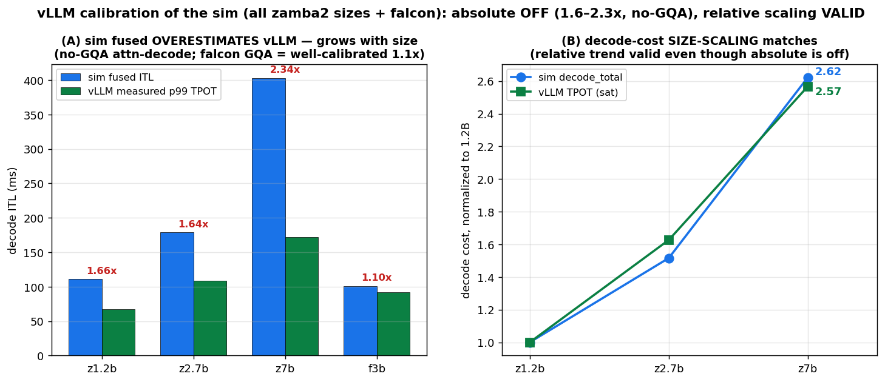

# 기존 프레임워크(vLLM) 비교 보완 — 4-way 비교군 + calibration

작성일: 2026-06-22 · 목적: 논문화를 위해 **fused(vLLM 실baseline)를 비교군에 포함**하고, sim을 vLLM 실측으로 **calibrate**해 비교의 신뢰도를 정직하게 박는다.
관련: [vllm_validation](vllm_validation.md) · [layer_aware_benefit](layer_aware_benefit_report.md) · [partition_engine_design](partition_engine_design.md)

> **핵심 발견(보완 결과):** 이전 `run_layer_aware`는 **fused(=vLLM 기본)를 빼고** co_schedule/agnostic/layer_aware 3개만 비교했다 — 즉 헤드라인 1.37~2.02×가 *agnostic 대비*였지 *vLLM 대비*가 아니었다. fused를 추가(4-way)하고 vLLM 실측으로 calibrate한 결과: **sim의 절대값은 모델-의존적으로 어긋난다**(zamba2 fused ITL 1.64× 과대·throughput 0.8× 과소; falcon은 1.09×로 양호) → **sim은 *방향*은 맞으나 *정량 비교*엔 부족하다.** 정량 framework 비교는 실엔진 프로토타입([Path C](partition_engine_design.md))이 선결.

## 1. 비교군 검토 (4개가 무엇이고, 실제 시스템과 어떻게 매핑되나)

| 정책 | 정의 | 실 시스템 대응 | multiplexing/scheduler |
|---|---|---|---|
| **fused** | prefill+decode를 *한 forward*(mixed batch)에 | ✅ **vLLM/SGLang 기본**(deployed) | 시간적 fusion · sync |
| **co_schedule** (two_stream) | 두 스트림 자유 SM 공유, 예약 없음 | ❌ 연구 baseline(MPS식, deployed 아님) | 공간 mux · decoupled |
| **agnostic_protect** | 전 레이어 decode floor 예약(layer-agnostic mux) | ❌ 연구(MuxWise/Bullet식 *아이디어*, deployed 아님) | 공간 mux · decoupled |
| **layer_aware_protect** | 비싼 attn 레이어만 예약(layer-aware mux) | ❌ **본 연구 제안** | 공간 mux · decoupled |

→ **실제 deployed 시스템은 `fused`뿐.** 나머지 셋은 연구 설계로, `fused`가 *유일한 외부 baseline*이다. ∴ 논문 헤드라인은 **layer_aware vs fused(vLLM)**여야 한다(agnostic 대비가 아니라).

## 2. 4-way 비교 (sim, vLLM-matched 워크로드 prompt2048/out128, 포화)

decode ITL_p99(ms) / throughput(tok/s):

| model | fused | co_schedule | agnostic | **layer_aware** |
|---|--|--|--|--|
| zamba2_1.2b | 111 / 1121 | 46 / 1316 | 26 / 1532 | **30 / 1964** |
| zamba2_2.7b | 179 / 692 | 80 / 758 | 38 / 644 | **44 / 1324** |
| zamba2_7b | 403 / 312 | 164 / 367 | 62 / 287 | **71 / 554** |

**구조(정성):** fused(decode가 forward에 *결합*) → ITL 최대. co_schedule(2-스트림 분리) → ITL↓. *_protect(decode SM *예약*) → ITL 최소+bounded. layer_aware는 거기에 prefill 환원으로 throughput까지 최대.

> **주의 — layer_aware ITL(44) > agnostic ITL(38)은 *열세가 아니다*:** 이는 *operating point(동시성)* 차이다. **같은 decode 배치에선 layer_aware ITL이 매번 *더 낮다*** (la의 ssm-decode는 two_stream으로 108 SM 전체 사용 vs agnostic의 예약 floor ~54 SM; ssm은 싸서 경합 영향 작음): b8 30.1<32.7, b32 35.9<37.9, b64 43.5<46.5. 그런데 **la는 throughput이 2×(1324 vs 644)라 동시 요청·decode 배치가 ~2× 크다** → agnostic p99=ds@b32(37.9), **layer_aware p99=ds@b64(43.5)**. decode ITL은 배치↑서 증가하므로 *더 높은 throughput 지점*의 la가 p99 ITL이 높게 보일 뿐 — 고전적 latency↔throughput 트레이드오프이고, 그 ITL(44)도 현실 SLO(≥50ms) 내라 goodput에서 이긴다.

## 3. vLLM calibration (sim fused vs 실측) — 신뢰도 박기

| model | sim fused ITL | vLLM p99 TPOT(sat) | ITL 비 | sim fused thru | vLLM thru | thru 비 |
|---|--|--|--|--|--|--|
| zamba2_1.2b | 111 | 67 | 1.66× 과대 | 1121 | 1413 | 0.79× 과소 |
| zamba2_2.7b | 178.8 | 109 | 1.64× 과대 | 692 | 870 | 0.80× 과소 |
| zamba2_7b | 403 | 172 | **2.34× 과대** | 312 | 346 | 0.90× |
| falcon_h1_3b | 100.7 | 92 | **1.09×** ✓ | 1236 | 1074 | 1.15× |

*(전 zamba2 크기 + falcon 실측 — job 783863·799168. sim fused ITL은 vLLM 포화 p99 TPOT 대비.)*

**왜 모델-의존·크기 의존:** sim은 per-layer 커널을 *unfused로 합산*해 과대평가하는데, 그 과대분은 *비싼 no-GQA attn-decode*에서 가장 크고 **레이어 수와 함께 커진다** → **zamba2 1.66×(1.2b)→1.64×(2.7b)→2.34×(7b)**, **falcon(GQA로 attn-decode 쌈)은 1.09×로 양호**. throughput은 0.79~0.90× 일관 과소. ∴ **sim의 절대 goodput@SLO·"layer_aware vs fused N×" 수치는 신뢰 불가**(zamba2, 특히 7b).

**그래도 *상대 size-scaling*은 검증됨(그림 B):** sim decode_total 정규화비(1.2b 1.00 / 2.7b 1.52 / 7b 2.62) ≈ vLLM 포화 TPOT 비(1.00 / 1.63 / 2.57) — **decode 비용의 크기-스케일링은 실측과 일치.** 즉 sim은 *절대값*은 틀려도 *크기 추세*는 맞다.

## 4. *그래도* 견고한 것 — calibration-invariant 결과

calibration은 모든 정책의 latency를 ~균일 배율로 움직이므로, **정책 간 *비율*은 배율에 불변**이다:

- **fused decode ITL / layer_aware decode ITL = 3.8×(1.2b) · 4.1×(2.7b) · 5.7×(7b)** — fused가 decode를 prefill forward에 결합해 layer_aware(decode 분리·예약)보다 **decode ITL이 4~6배 높다.** 이 *비율*은 calibration에 불변.
- **vLLM이 이 방향을 실측 확인:** vLLM fused TPOT가 부하↑서 **12→80ms(median)·22→109ms(p99)로 팽창**([vllm_validation](vllm_validation.md)) = "fused는 decode를 prefill에 결합한다"의 직접 증거.
- 따라서 **vLLM-anchored 추정:** vLLM fused 포화 ITL ~80~109ms를 기준 삼으면, layer_aware decode ITL ≈ 그 1/4~1/6 ≈ **15~27ms**(예약·분리로 bounded). 두 값 사이 SLO에서 layer_aware는 충족·fused는 위반.

## 5. 정직한 결론 & 논문 함의

- **정량 framework 비교는 sim만으로 불충분**하다(절대값 모델-의존 오차). 논문에서 "layer_aware가 vLLM 대비 N× goodput"을 *sim 수치로* 주장하면 안 된다.
- **논문화 가능한 것:** (a) **구조적 주장** — fused는 decode를 prefill에 결합해 부하 하 decode ITL이 팽창(layer_aware 대비 4~6×); 이건 **vLLM 실측으로 검증**됨. (b) layer_aware가 그 ITL을 예약·분리로 bound한다는 *메커니즘*. (c) decode ITL이 SLO를 가르는 regime에서 layer_aware가 fused를 이긴다는 *방향*.
- **정량 수치(N× goodput)를 논문에 넣으려면** → 실엔진 프로토타입([Path C](partition_engine_design.md), green-ctx 커널로 4 정책을 *실측*)이 필수. sim의 역할은 *가설·구조 제시*까지.
- **comparison set은 타당**하되, `fused`만 외부 baseline이고 나머지는 연구 설계임을 명시할 것. co_schedule=naive mux baseline, agnostic=prior-art PD-mux 아이디어, layer_aware=제안.

## 6. 코드 변경

`run_layer_aware.py`에 **fused 정책 추가**(sync scheduler, full-model fused step = Σ_layers(solo_prefill+solo_decode), fusion_saving≈0 근거) → 4-way 출력 + `layer_aware vs fused/agnostic` 비율 표기. (`_POLICY`에 fused, `_SCHED={fused:sync, 나머지:decoupled}`.)
