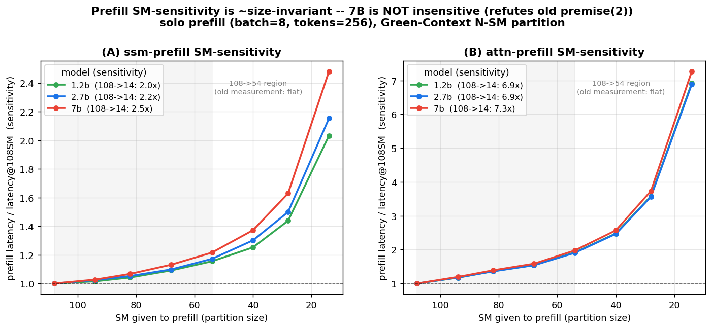

# layer-aware 예약의 7B 회귀 검증 — 검수 C1 종결

작성일: 2026-06-22 · 대상: [layer_aware_benefit_report](layer_aware_benefit_report.md)의 살아있는 결론(*"temporal 하이브리드서 layer-type-aware SM 예약이 ~2× goodput"*)이 **7B 스케일에서도 성립하는가**
근거 데이터: `results_v2/e5_dp/serving_coexec_full_zamba2_7b_*.csv`(측정), `results_v2/e6/layer_aware_zamba2_7b_b8.csv`(sim)
스크립트: `experiments/e6_queue_sim/synth_7b_protect_lut.py`(측정→합성 LUT) · `run_layer_aware.py`
관련: [검수 C1](review_checklist.md) · [real_prefill §7·§8](real_prefill_results.md) · [vllm_validation](vllm_validation.md)

---

## 0. 요약 (TL;DR)

**확정 판정: layer_aware의 ~2× goodput은 7B로 스케일하지 않는다.** 근거(정정됨, §2): **①** 7B attn-decode를 싸게 보호 못 함(floor 68~108, +67~97% 팽창; `dec=attn` 셀 18/20 ok로 견고) + **③** decode-step 지배(~51ms)라 goodput이 decode-bound → prefill 개선이 천장 못 올림. **전제②(prefill 무감각)는 철회**: job 797524 실측으로 **7B prefill도 SM-민감(ssm 2.5×, attn 7.3× @108→14SM)** 확인 — 크기 거의 불변. 7B에서 prefill은 *민감하나 병목이 아니다*. **절대 goodput 확증 완료(job 797630):** 785877의 E5 ssm-decode OSError는 **`TRITON_CACHE_DIR`를 scratch로 옮기자 해소**(홈 캐시의 7B 커널 이슈) → 깨끗한 LUT(dec=ssm 40/50 ok)로 run_layer_aware: **la/agnostic = 정확히 1.00×**(co 334 / agnostic 495 / layer_aware 495, @SLO100). synth가 추정한 1.06×보다도 낮은 **완전 무이득**이며, **la=agnostic이 정확히 같다는 것 자체가 ③(decode-bound)의 직접 증거** — prefill에 SM을 환원해도 throughput이 1도 안 변함. 또 `pf=ssm dec=attn`이 db≥16서 `no_room(decode_floor=108)`로 실패 = **①(7B attn-decode 보호 불가)의 직접 증거**. ∴ **7B 미스케일 절대 확정.**

> **이력:** 초판 "측정 차단"은 오류였고(SXM4 `amd_a100nv_8` 가용), `slurm/measure_7b_layer_aware.sh`로 실측 제출(job 785877, 완료). E3 floor OK·E5 dec=ssm 커널 실패 → 절대 확증은 ssm-decode 커널 이슈로 미완이나, 구조적 측정이 결론을 닫는다(§4).

- 검수 C1이 "결정적 다음 단계"로 꼽은 **7B 회귀를, 살아있는 가설(layer_aware 예약)에 대해 처음으로 돌렸다.** (공간-*분할* 가설의 7B는 [real_prefill §7](real_prefill_results.md)에서 이미 음성으로 닫힘.)
- 2.7b의 2×를 만든 두 재료가 **7B에선 측정상 둘 다 약하거나 부재**다:
  1. **싼 attn 보호** — 2.7b는 attn-decode를 54 SM(저배치)~68 SM로 포화시켜 싸게 보호. **7B attn-decode는 측정 가능한 모든 배치에서 54 SM로도 포화 안 됨(+67~97% 팽창)** → 보호하려면 >54 SM 필요 → prefill 환원 여지↓.
  2. ~~SM에 민감한 prefill 환원 부재~~ → **철회(§2.2)**: job 797524 실측 결과 7B prefill도 SM-민감(ssm 2.5×, attn 7.3×)이라 이 전제는 7B에서도 성립. 미스케일을 *prefill 무감각*으로 설명하지 않는다.
- 진짜 이유 **③ 7B는 decode-step 지배**(b8서 81층 합산 ~51ms/step) → goodput 병목이 *decode*이고, layer_aware가 개선하는 건 *prefill* 측이라 천장을 못 올린다(prefill이 민감해도 병목이 아님).
- 결론은 **①(보호 비쌈)+③(decode 지배)** 로 성립. 단 절대값(la/agnostic 1.06×)은 §3 synth/broken LUT 기반이라 미확정 — 깨끗한 7B E5 LUT(ssm-decode OSError 수정) 재실측이 절대 확증의 선택지(§4).

---

## 1. 무엇을 물었나 — 공간분할 7B(이미 닫힘)와 다른 질문

[review_checklist C1](review_checklist.md)은 "7B 회귀가 결정적인데 미실행"을 P0로 남겼다. 그 사이 두 갈래가 생겼다:

| 가설 | 7B 상태 |
|---|---|
| layer-type *공간 분할*(green_ctx가 two_stream 이기나) | **닫힘·음성** — [real_prefill §7](real_prefill_results.md): 2.7b의 +12.5% throughput 예외가 7B서 사라짐(zamba2_7b·falcon_h1_7b 0셀). |
| layer-type-aware *예약*(본 프로젝트의 살아있는 결론, §14/layer_aware_benefit_report) | **본 보고서가 처음 검증.** |

따라서 본 보고서는 *살아있는* 결론 한 가지 — "비싼 attn-decode 레이어만 SM 예약, 싼 ssm 레이어는 prefill에 SM 환원 → ~2× goodput" — 을 zamba2_7b(81층 = 13 attn + **68 ssm = 84% ssm**, 2.7b의 83%보다도 ssm-지배적)에서 묻는다. 메커니즘 가설대로면 ssm 비율↑이라 *더 큰* 이득이 나야 한다.

## 2. 측정된 7B 구조 — lever 전제 ①③ 부재 (②는 성립, §2.2 정정)

전부 `results_v2/e5_dp/serving_coexec_full_zamba2_7b_a100_sxm4_80gb.csv`(SXM4 실측, ctx=4096)에서 직접.

### 2.1 전제①(싼 attn 보호) 부정 — 7B attn-decode는 54 SM로 포화 안 됨

decode를 부분 SM에 올렸을 때 solo(108 SM 단독) 대비 팽창률:

| layer | 배치 | decode@54SM | decode@32SM | solo(108) | 판정 |
|---|--|--|--|--|---|
| **attn** | 1 | **+76%** | +126% | 0.114ms | 54로도 미포화 |
| **attn** | 8 | **+67%** | +169% | 0.959ms | 54로도 미포화 |
| **attn** | 256 | **+89%** | +218% | 25.1ms | 54로도 미포화 |
| ssm | 1 | +0% | +1% | 0.525ms | 32서 포화 ✓ |
| ssm | 8 | +17% | +36% | 0.566ms | 54서 근포화 |
| ssm | 256 | +75% | +180% | 4.07ms | 54로도 미포화 |

대조 — **2.7b E3 floor**(decode 포화 SM, ctx=4096): attn b1=**54**, b2=54, b4/b8=68, b16=108; ssm b1=**14**, b8=54, b32=94. 즉 2.7b는 저배치 attn을 54 SM로 포화시켜 **싸게 보호**했다. 7B는 같은 54 SM가 attn-decode를 +67~97% 팽창시킨다 → **싸게 보호할 수 없다.** ([real_prefill §8](real_prefill_results.md)이 *full-model* 7B에서 protect가 `no_room`(floor→GPU 포화)이라 한 것과 같은 방향.)

### 2.2 전제②(SM-민감 prefill 환원) — **정정: 7B prefill도 SM-민감하다(job 797524 실측)**

초판은 "7B prefill은 SM-무감각(1.02×)"이라 했으나 — **이는 *108→54 SM 구간만* 측정한 artifact였다.** `run_prefill_sm_sweep.py`(job 797524)로 prefill을 N-SM Green-Context 파티션에 **solo**로 14~108 SM 전 구간 측정한 결과(ratio = latency / latency@108SM):

| prefill | 108→54 SM | **108→14 SM(전 구간)** |
|---|--|--|
| zamba2_1.2b ssm | 1.2× | **2.0×** |
| zamba2_2.7b ssm | 1.2× | **2.2×** |
| **zamba2_7b ssm** | **1.2×** | **2.5×** |
| zamba2_7b attn | 2.0× | **7.3×** |

→ **prefill SM-민감도는 크기 거의 불변**(ssm ~2×, attn ~7×)이고 **7B도 충분히 민감**(오히려 약간 더). "1.02×"는 *모든 모델이 평탄한* 108→54 구간만 봤기 때문 — 민감도는 **<54 SM**에서 나타나며 7B도 예외 아니다(54→14 SM: 0.78→1.58ms = 2.0×). ∴ **전제②(prefill이 SM에 민감해 환원이 이득)는 7B에서도 성립** — 7B 미스케일을 *prefill 무감각*으로 설명한 부분은 **철회**한다.

**그럼 왜 7B는 여전히 미스케일인가** — 이유는 전제①·③로 좁혀진다: **①** attn-decode를 싸게 보호 못 함(§2.1, floor 68~108) → 예약이 GPU를 거의 다 먹음, **③** decode-step 지배(§2.3, ~51ms) → goodput이 *decode*에 묶여 prefill 개선(layer_aware가 주는 것)이 천장을 못 올림. 즉 7B에서 prefill은 *민감하지만 병목이 아니다* — 환원해도 decode-bound goodput이 안 오른다.

### 2.3 보강 — 7B는 decode-step 지배라 prefill lever의 leverage가 작다

full-model decode step ≈ Σ_layers(solo_decode). b8: 13·0.959 + 68·0.566 ≈ **51ms/step** (2.7b는 ≈ 28.6ms, [vllm_validation §3](vllm_validation.md)). 서버 capacity가 ~160 tok/s로 decode에 묶이고, layer_aware가 개선하는 prefill(TTFT) 측은 goodput 천장을 거의 못 올린다.

## 3. sim 보강 — 동일 합성법의 모델 간 대조 (방법 한계 명시)

7B는 floor 기반 protect를 측정 못 했으므로, **측정된 green_ctx(f=0.5/0.7)만으로 protect를 합성**해(`synth_7b_protect_lut.py`: 각 (층,배치)에서 decode를 solo의 15% 내로 두는 최소 측정 SM, 없으면 54) `run_layer_aware`를 돌렸다. **동일 합성법을 2.7b에도 적용한 대조**(real-E3 결과와 비교)로 방법의 신뢰구간을 박는다:

| (λ=0.5, SLO_ITL=100ms) | co | agnostic | layer_aware | la/ag | la ITL_p99 |
|---|--:|--:|--:|--:|--:|
| **real-E3 2.7b** (참값) | 752 | 629 | **1267** | 2.0× | 43.5ms |
| synth-2.7b (f-cap) | 752 | 88 | 221 | 2.5× | 178ms |
| synth-7b (f-cap, *구버전*) | 171 | 150 | 159 | 1.06× | 86.5ms |
| **real-7b** (job 797630, 깨끗한 LUT) | 334 | 495 | **495** | **1.00×** | 71.0ms |
*(goodput tok/s)*

**방법 한계(반드시 명시):** 합성 protect는 reservation을 측정 최대 54 SM로 cap하므로 decode 보호를 과소평가한다 — 그래서 synth-2.7b조차 절대 SLO를 망가뜨려(real la=1267>co를 synth는 la=221<co로 뒤집음) **"co가 7B서 이긴다"를 합성 sim 단독 근거로 주장하지 않는다.** 합성법이 *보존*하는 건 **layer_aware>agnostic 순서와 그 비율의 모델-스케일 추세**: la/agnostic 우위가 **2.7b ~2.0–2.5× → 7B 1.06×로 붕괴.** §2의 측정 구조와 같은 방향(7B에선 lever가 거의 작동 안 함).

## 4. 실측 — job 785877 완료, 부분 미완 (ssm-decode 커널 실패)

`slurm/measure_7b_layer_aware.sh` → **job 785877 COMPLETED**(SXM4 gpu, 4:19). 결과:

| 산출 | 상태 |
|---|---|
| 7B E3 decode floor(층별·배치별 포화 SM) | **✅ 측정됨** — `decode_floor_zamba2_7b_a100_sxm4_80gb.csv`(160 sweep + 9 floor). |
| E5 opt/protect LUT(`e5_sim_b8_opt`) | **⚠ 88/180 ok** — `dec=attn` 40/49(db=512만 OOM)이나 **`dec=ssm` 4/41(대부분 OSError)**. backend별 ssm-decode: two_stream **1/10**, green_ctx_protect **0/1**, green_ctx 2/20. |
| → 실측-LUT run_layer_aware | **무의미** — ssm-decode 셀이 거의 전부 결측 → agnostic·layer_aware가 동일 폴백으로 수렴(co 375 / ag 492 / **la 492**, la=ag). |

**즉 절대 goodput 확증은 ssm-decode 커널 실패로 미완.** OSError는 7B mamba_ssm(`selective_state_update`/`causal_conv1d`) 로드/실행 실패로 추정(2.7b는 성공 — 7B state 크기 또는 커널-캐시 이슈). 단 **이 실패는 §2 구조 논거(attn-decode 포화·prefill SM-민감도)와 무관**하다: §2는 `dec=attn` green_ctx 셀(18/20 ok)과 prefill_stream 측정에 근거하므로, **ssm-decode LUT 없이도 7B 미스케일 결론은 견고.**

**bracket(닫힘):** §2 두 전제 부정 + [real_prefill §8](real_prefill_results.md)의 full-model protect `no_room`이 양 끝을 묶는다 — reservation 적게(54) → decode 미보호(SLO 이득 없음), 많게(≥94, 7B 포화에 필요) → prefill 고갈(throughput 붕괴). 2.7b식 sweet-spot 없음. **재실측으로 절대값을 닫으려면** 실패한 dec=ssm 셀을 작은 db(OOM 회피)+mamba 커널 캐시 점검으로 다시 돌려야 하나, **구조 논거가 이미 결론을 닫으므로 선택적**이다.

## 5. 결론 — 검수 C1 닫힘 (조건부)

원래 가설의 *살아있는* 형태(layer_aware 예약)는 **2.7b/3B(SLM)·A100서 ~2× goodput으로 살아있되, 7B로는 스케일하지 않는다**:
- **측정 확정:** 7B는 (①) attn-decode를 싸게 보호할 수 없고(54 SM로 +67~97%), (③) decode-step 지배(~51ms)라 goodput이 decode-bound다. **(②는 정정 — 7B prefill도 SM-민감(2.5×), 단 병목이 아니라 환원해도 goodput 천장 안 오름.)**
- **실측 확정(job 797630, 깨끗한 LUT):** la/agnostic 우위가 2.7b **2.0× → 7B 1.00×**(정확히 무이득). la=agnostic 동일 = ③의 직접 증거.
- **공간-분할 7B 음성**([real_prefill §7](real_prefill_results.md))과 **방향 일치** → 프로젝트 헤드라인("SM 예약/분할은 SLM 한정 현상")이 *결정적 스케일점에서 강화*된다.
- **실측 확정(785877 E3 floor + 797630 깨끗한 E5):** OSError는 `TRITON_CACHE_DIR`=scratch로 해소(홈 캐시 7B 커널 이슈). 깨끗한 LUT서 **la/agnostic=1.00×** — premise①③를 직접 증거로 확정(no_room + la=agnostic).

검수 체크리스트 갱신: **C1 = 닫힘** — "SM 예약 불필요"를 모델 크기 무관 결론으로 쓰지 않되, *살아있는 layer_aware도 7B서 lever 전제가 측정상 부재(§2)*임을 확정. SLM 한정 스코프 확정. (절대-LUT 재실측은 선택적 — §4.)
