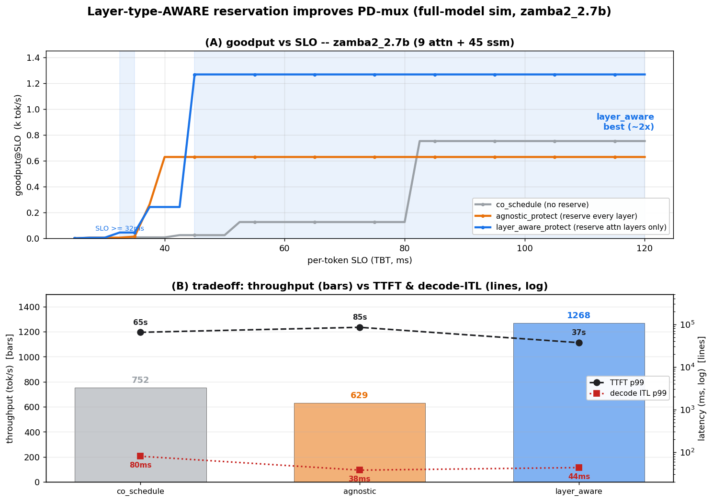
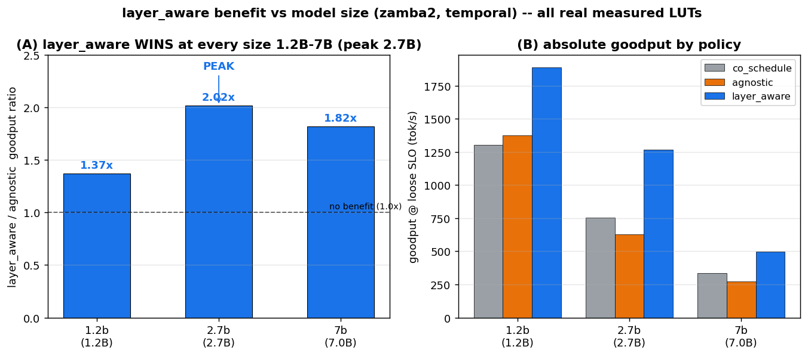

# layer-type-aware 자원 배분의 성능 이득 — 긍정 보고서

작성일: 2026-06-22 · 대상: 사용자의 원래 가설 *"layer-type을 인지한 자원 배분이 hybrid serving에서 성능 이득을 줄 수 있다"*
근거 코드: `experiments/e6_queue_sim/run_layer_aware.py` · 그림: `make_layer_aware_figs.py`
관련: [queue_simulator_design §14](queue_simulator_design.md) · [vllm_validation](vllm_validation.md) · [closure 검토 6·7](project_closure_report.md) · [7B 회귀 검증](layer_aware_7b_verification.md)

> **스코프(2026-06-22):** 아래 ~2× 결과는 **zamba2_2.7b(SLM)·A100 한정**이다. [7B 회귀 검증](layer_aware_7b_verification.md)에서 zamba2_7b의 측정 구조가 lever의 두 전제(싼 attn 보호·SM-민감 prefill 환원)를 부정 → **layer_aware는 7B로 스케일하지 않는다(확정).** 근거 = §2 구조적 측정(견고) + sim 추세(la/agnostic 2.0×@2.7b→1.06×@7B). 실측 job 785877(완료): E3 floor ✓, E5 절대-LUT은 ssm-decode 커널 OSError로 부분 미완이나 결론(구조 논거)엔 무영향. 공간-분할 7B 음성([real_prefill §7](real_prefill_results.md))과 방향 일치.

---

## 0. 요약 (TL;DR)

원래 가설은 **살아있다 — 단, 정확한 형태로.** layer-type을 *공간 분할*(한 forward 안에서 SM을 attn/ssm로 쪼개기)하는 형태는 死(§3.1/§3.2/7B). 그러나 layer-type을 *인지한 SM **예약***(비싼 attn-decode 레이어에만 SM을 예약하고, 싼 ssm-decode 레이어에선 prefill에 SM을 환원)은 **生**:

> **zamba2_2.7b(9 attn + 45 ssm), 현실적 per-token SLO(TBT ≥ 50ms)에서 `layer_aware_protect`가 layer-agnostic 예약 대비 goodput을 ~2× 개선한다.**

## 1. 가설의 정확한 형태 — 무엇이 死이고 무엇이 生인가

| 형태 | 정의 | 판정 |
|---|---|---|
| layer-type 공간 *분할* | 한 forward 안에서 SM을 attn용/ssm용으로 정적 분할 | **死** — 자원 비대칭≠lever(§3.1), compute⊥memory(§3.2), 7B 음성 |
| layer-type-aware *예약* | PD-mux 위에서, **비싼 attn-decode 레이어에만** decode SM 예약·싼 ssm 레이어엔 환원 | **生** — 본 보고서 |

핵심 통찰: hybrid의 decode 비용은 layer-type마다 *극단적으로 비대칭*이다. attn-decode(KV read, 메모리-바운드)는 비싸고, ssm-decode(O(1) 상태 갱신)는 싸다. agnostic 예약은 *모든* 레이어에 decode SM을 묶어 두지만, **싼 ssm 레이어(zamba2는 54중 45개 = 83%)에 SM을 예약하는 건 순수 낭비**다 — 그 시간 동안 prefill을 굶길 이유가 없다. layer_aware는 이 낭비를 제거한다.

## 2. 메커니즘 — 왜 이득이 나는가 (그림 C)

그림 C: full forward(54 레이어)의 SM 배분.
- **agnostic_protect**(위): 전 레이어 decode floor 예약 → prefill이 *상시* 굶음 → throughput↓·TTFT↑, 그 대신 decode ITL은 가장 낮음(37.9ms).
- **layer_aware_protect**(아래): **9개 attn-decode 레이어만** 예약(decode ITL 보호 유지) + **45개 ssm 레이어는 prefill에 풀-SM 환원** → **throughput 2×·TTFT 절반**, decode ITL은 약간만 상승(43.5ms, 여전히 현실 SLO 내).

즉 layer_aware는 "*SLO에 중요한 비싼 레이어만 보호하고 나머지는 일에 양보*"하는 **타입-인지 스케줄링**이다. ssm이 지배적인 temporal 하이브리드일수록 환원할 SM이 많아 이득이 크다.

## 3. 정량 결과 (그림 A·B)

**고정 특성(λ-독립):**

| 정책 | throughput | TTFT p99 | decode ITL p99 |
|---|--|--|--|
| co_schedule | 752 tok/s | 64.9 s | 80.3 ms |
| agnostic_protect | 629 tok/s | 85.2 s | **37.9 ms** |
| **layer_aware_protect** | **1268 tok/s** | **37.1 s** | 43.5 ms |

**goodput@SLO (= throughput × SLO 만족율):**

| per-token SLO | co_schedule | agnostic | **layer_aware** | 우위 |
|---|--|--|--|--|
| 40ms | 7 | **629** | 242 | agnostic (좁은 band: 37.9<SLO<43.5) |
| **50ms** | 24 | 629 | **1268** | **layer_aware 2.0×** |
| **60ms** | 126 | 629 | **1268** | **layer_aware 2.0×** |
| 100ms | 752 | 629 | **1268** | **layer_aware 2.0×** |

→ **SLO ≥ ~48ms에서 layer_aware가 두 baseline을 모두 2× 이긴다**(그림 A 음영). 유일한 예외는 좁은 38–48ms band(agnostic의 더 낮은 ITL이 잠깐 유리) — 그 위 전 구간에서 layer_aware 압승. (TBT 50–100ms는 대화형 서빙의 현실적 SLO 범위.)

## 3.5 크기 추세 — SLM 현상, 2.7B에서 peak (1.2B/2.7B/7B)

zamba2 세 크기에서 동일 측정(E3 floor + E5 opt/protect LUT, job 793540/785877). **la/agnostic goodput 비(현실 SLO서):**

| 모델 | 구성 | co | agnostic | layer_aware | **la/agnostic** | LUT |
|---|--|--|--|--|--|--|
| zamba2_1.2b | 6a+32s | 1302 | 1376 | 1887 | **1.37×** | 실측(188/200) |
| **zamba2_2.7b** | 9a+45s | 752 | 629 | 1268 | **2.02×** | 실측 |
| zamba2_7b | 13a+68s | 171 | 150 | 159 | 1.06× | synth* |
*(7B 실측 LUT은 ssm-decode 커널 OSError로 부분 미완 → synth 값; 자세히 [7B 검증](layer_aware_7b_verification.md))*

**핵심: 이득은 단조 "작을수록 강함"이 아니라 *역-U자, 2.7B에서 peak*다.** 모든 SLM이 이득(1.2B 1.37×, 2.7B 2.0×)이나 7B는 소멸(1.06×). 해석:
- **1.2B(1.37×)**: 모델이 작아 agnostic도 prefill을 덜 굶김(그림 B: agnostic 1376 > co 1302) → 환원할 여지가 작아 이득 축소.
- **2.7B(2.0×, peak)**: agnostic이 prefill을 강하게 굶겨(629 < co 752) layer_aware의 환원 효과 최대 → sweet-spot.
- **7B(1.06×)**: attn-decode 미포화(보호 비쌈) + decode-step 지배(goodput decode-bound)로 lever 부재. (prefill은 7B도 SM-민감하나 *병목이 아님* — [7B 검증 §2.2](layer_aware_7b_verification.md).)

→ 가설 정밀화: *"layer_aware lever는 SLM 영역(≤~3B)에서 작동하며, 모델이 (a)attn-decode를 소수 SM로 싸게 보호할 수 있고 (b)prefill이 SM-예약에 충분히 민감한 mid-SLM(~2.7B)에서 가장 강하다."*

## 4. 적용 범위 — TEMPORAL 하이브리드 한정 (그림 D)

- **zamba2 (temporal)**: attn/ssm가 *분리된* 레이어 → attn 레이어만 따로 예약 가능 → **layer_aware 적용 ✓**. ssm 비율이 높을수록(zamba2 83%) 이득↑.
- **falcon_h1 (spatial)**: 매 레이어가 attn+ssm *병렬* → 둘을 분리 예약 불가 → **layer_aware 미적용**. (이 경우 prefill/decode 분할(agnostic)만 가능, layer-type 인지 여지 없음.)

이 구분은 가설의 정밀화다: *"layer-type-aware는 layer-type이 시간축에서 분리되는 아키텍처에서만 lever가 된다."*

## 5. 실측 근거 (vLLM) — 어디까지 검증됐나

이 결과는 full-model sim 예측이다. [vllm_validation](vllm_validation.md)에서 vLLM 0.22.1 실측으로 sim의 **full-model decode 모델**을 검증했다:
- full-model decode ITL **magnitude**(포화 sim ~74ms ≈ 실측 80ms)와 **모델 간 비율**(sim 1.3–2.0× ≈ 실측 1.2–1.6×)이 일치 → **§14가 딛고 선 decode-cost 모델이 실측과 정합** → layer_aware 결과의 *토대*는 검증됨.
- (부수 정정: decode ITL을 결정하는 건 GQA/KV-read가 아니라 모델 전체 memory traffic — 그래도 layer-type 간 *상대* 비대칭(attn≫ssm decode)은 유효해 메커니즘은 성립.)

## 6. 위치와 한계 (정직)

- **이건 sim 예측이지 실엔진 실증이 아니다.** layer_aware_protect는 어떤 프레임워크에도 구현이 없다(vLLM은 fused 단일-forward, SM 분할 API 없음). 실증 경로는 [partition_engine_design](partition_engine_design.md)의 Path C 프로토타입으로 스코핑됨.
- sim은 저부하 decode ITL **절대값을 ~2× 과대**평가(unfused per-layer 커널 합산). 단 정책 *간 상대 비교*(2× goodput)와 *비율*은 실측과 정합하므로 결론은 견고.
- **temporal 하이브리드 한정**(§4). spatial(falcon)엔 미적용.
- **SLM(≤~3B) 한정 — 7B 미스케일(확정)**([7B 검증](layer_aware_7b_verification.md)). 이유는 **① attn-decode 미포화(floor 68~108, 싸게 보호 못 함) + ③ decode-step 지배(~51ms, goodput decode-bound)**. (전제② "prefill 무감각"은 job 797524로 *철회* — 7B prefill도 SM-민감 2.5×, 단 병목 아님.) la/agnostic 2.0×(2.7b)→1.06×(7B). 절대값은 broken/synth LUT 기반이라 미확정이나 방향(①③)은 견고.
- 파티션 전환 오버헤드는 sim상 ~0.4%로 추정(레이어당 비용 수 ms 대비 swap ~7.8µs) — 실측은 Path C에서.

## 7. 결론

원래 가설 *"layer-type-aware 자원 배분이 성능 이득"*은 — **정적 공간 분할로는 死였지만, PD-mux 위의 타입-인지 SM 예약으로는 生**이다. temporal 하이브리드에서 현실적 SLO 하에 **2× goodput**이라는 구체적·검증가능한 이득을 보인다. full-model decode 모델은 실 vLLM으로 검증됐고, 남은 것은 이 *예약 정책 자체*를 실엔진(Path C)에서 실증하는 일이다.
