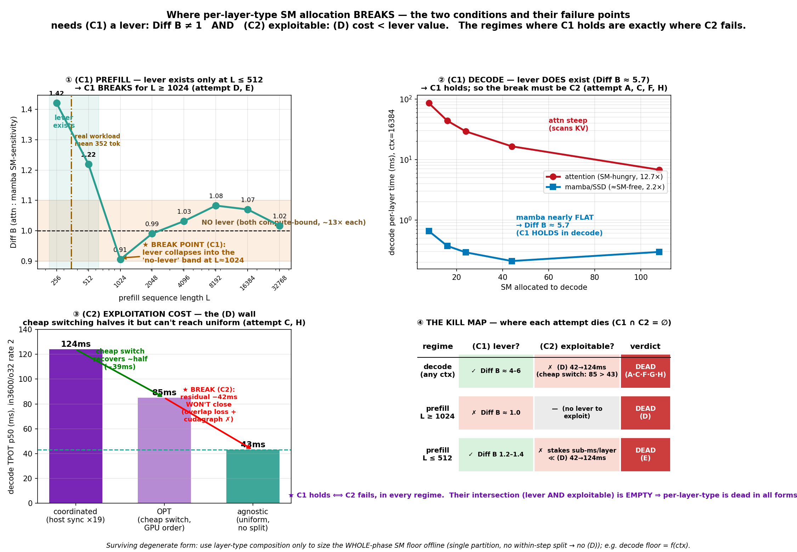

# per-layer-type SM 배분 — 구제 시도와 기각 수순 (postmortem)

작성 2026-07-18. 정본 [CONSENSUS.md](CONSENSUS.md)의 **kill-chain 관점 정리**: [research_arc.md](research_arc.md)가 *시간순 서사*라면 이 문서는 ***"per-layer-type을 살리려던 각 시도가 어떤 링크에서 죽었나"*** 를 구제-시도별로 정렬한다.

## 0. 정책이 성립하려면 필요한 두 조건

per-layer-type SM 배분(attn 레이어와 mamba 레이어에 SM을 다르게)이 이득이 되려면 **둘 다** 참이어야 한다:

- **(C1) lever 존재**: 두 레이어 타입이 SM에 **다르게 반응**해야 한다 — **Diff B = attn 민감도 / mamba 민감도 ≠ 1**. (비용비 Diff A가 다른 것만으론 부족 — 그건 재배분 가능성이 아니라 절대 비용 차이일 뿐.)
- **(C2) 착취 가능**: lever를 실현하는 **실행 비용((D) granularity)이 lever의 가치보다 작아야** 한다.

모든 구제 시도는 이 둘 중 하나를 공략했다. **결론: (C1)은 특정 regime서 참이나, 그 regime마다 (C2)가 깨진다.** 교집합이 공집합.

---

## 1. 구제 시도 → 기각 수순 (시도별)

### 시도 A — 창립형: decode-side "mamba는 SM-free" (C1 공략)
- **주장**: decode에서 mamba는 SM에 거의 무반응(recurrent state 업데이트=memory-bound), attn은 SM-hungry(KV 스캔) → mamba 파티션 줄여 attn에 몰아주면 이득. sim에서 生.
- **(C1) 검증**: ✅ **참**. decode Diff B ≈ **4.0×** (attn 8→108 10.8× 민감 vs mamba 2.7×; `decode_vs_prefill_sensitivity.png`). lever는 실재.
- **기각 (C2 실패 — 서빙 실증)**: 4-모델 서빙서 **agnostic이 4/4 승**, **Zamba2는 rate 3부터 goodput 0**(사전예측 "45/54 환원 대박"의 정반대). lever는 있으나 서빙 배치에서 착취가 손해.
- **교훈**: sim/micro-measurement가 서빙을 예측 못 함(반복 4회 중 1회째).

### 시도 B — "이진 strawman이다": graduated per-type map (C2 재공략)
- **주장(사용자)**: 지금까지 la는 이진 strawman, agnostic은 over-provisioning. per-type **점진(graduated)** SM map이면 다를 것.
- **경과**: 1차 결론 "knee≈84·잉여 없음"을 **철회** — 구현이 decode를 미조율 green-ctx에 둬 경합한 아티팩트(coordinated 54=42ms vs 미조율 54=**121ms**). 잉여는 실재. ⇒ 가설 부활, **조율 구현으로 재판** 필요.
- **기각 아님(이 단계는 재개)**: 부정된 건 가설이 아니라 내 측정.

### 시도 C — coordinated per-type를 실제 구현 (C2 정면)
- **주장**: 미조율이 문제면 조율된 per-type를 진짜 구현해 판정.
- **기각 (C2 실패 — 실측)**: `event_loop_pdmux_coord` 구현·정확성 게이트 통과했으나 **TPOT 42 → 124ms**. tuned uniform split도 agnostic 이김.
- **기전 = (D) granularity 실증**: decode 한 스텝이 **19 윈도우 파편화** → sync 직렬화 + partition 핀 + overlap 감소. ★**창립 가설이 *작동 구현*으로 실엔진서 최종 반증.**

### 시도 D — prefill-side로 이동: "decode는 죽었지만 prefill은?" (C1 재공략)
- **주장**: prefill은 원래 sub-step 청크(≈18층)로 도니 la의 자연스러운 무대. "L 길면 attn 민감도가 벌어질 것"(사용자).
- **(C1) 검증**: ❌ **거짓 (L≥1024)**. (B,L) knee: **Diff A(비용비)는 L 따라 0.5×→10× 열림**(사용자 직관 맞음)이나 **Diff B(민감도비) ≈ 1.0 전 격자**. 둘 다 compute-bound(mamba SSD-prefill도)라 SM에 ~13× 동일 반응.
- **기각**: lever 자체가 없음. §14 예약도 Probe4서 fixed d16으로 degenerate.

### 시도 E — WIDE 스윕: "짧은 L에선 lever가 열리지 않나?" (C1 재공략, 이번 세션)
- **주장(사용자)**: 옛 격자가 L≥2000만 봤고 실 워크로드(98%가 L<2000)를 안 덮음. L=256까지 넓혀라.
- **(C1) 검증**: ✅ **부분 참**. Diff B: **L=256 → 1.42, L=512 → 1.22**, L≥1024 ≈1.0 (`knee2d_wide.png`). **실 워크로드 mean 352 tok이 lever 구간 안.** lever는 짧은 L서 실재.
- **기전**: 타입 scaling 차이가 아니라 **짧은 L서 둘 다 SM 미활용**(attn 5.9×/mamba 4.2×, 이상 13× 대비), mamba가 44 SM서 포화.
- **기각 (C2 실패)**: lever 절대 stakes = **sub-ms/layer**(L256 attn 0.09ms) ≪ (D) 비용 **42→124ms**. **batch도 lever 안 엶**(관측 bs 버킷 Diff B 0.98–1.09). ⇒ lever는 있으나 (D)가 삼킴.

### 시도 F — "런타임 말고 offline predictor/floor로 고정하면?" (C2 우회, 이번 세션)
- **주장(사용자)**: per-type 분할을 런타임에 정하지 말고 offline 고정값/floor로.
- **기각 (C2 오해 규명)**: **(D)는 *실행시* 비용이지 *결정시* 비용이 아니다.** offline 고정값이라도 실행 시 attn↔mamba 경계마다 green-ctx 재분할 필요 → step 파편화·sync 직렬화 그대로. offline은 **결정 오버헤드만** 제거. ⇒ per-layer 분할은 offline이어도 死.

### 시도 G — "decode-attn은 memory-bound라 SM 줘도 소용없지 않나?" (C1 재해석, 이번 세션)
- **주장(사용자)**: 시도 A의 decode "attn SM-hungry"는 틀림 — memory-bound라 SM 추가가 무의미.
- **검증**: 이론은 옳으나 **실측 반대** — triton/no-cudagraph 커널은 HBM 대역폭 **미포화(MLP-limited)라 108 SM까지 ~선형 스케일**(효율 44→108서도 ≈1.0; `decode_attn_saturation.png`). SM이 실제로 도움.
- **결말**: (C1) lever는 오히려 **강화**(decode Diff B 유효). 단 운영점(cudagraph)선 HE2가 decode non-binding 관측 ⇒ 운영점 magnitude는 열린 질문. **어느 쪽이든 (C2)가 막으므로 정책 판정 불변.**

### 시도 H — "미리 준비된 green-ctx로 싼 전환하면 (C2) 넘지 않나?" (C2 정면, 이번 세션)
- **주장(사용자)**: (D)가 green-ctx 재조정 비용이면, pre-created green-ctx로 그냥 전환하면 되지 않나.
- **검증**: green-ctx는 **이미 pre-created**(`initialize_stream_groups`, 스위치=인덱싱; 생성비용 애초 없음). 실제 스위치 비용 = 경계마다 `stream.synchronize()` **드레인**. 이를 GPU측 wait_stream 순서화로 교체(`PDMUX_LA_COORD_OPT`): **124 → 85ms (갭 ~47% 회수)**.
- **기각 (C2 절반만 회수)**: OPT도 agnostic(42ms 평탄)에 **여전히 패배**. 잔차 = **구조적 오버랩 손실**(monolithic prefill이 window 0만 오버랩, 윈도우수 무관·모델 독립) + **cudagraph 비양립**(step 중간 전환 캡처 불가→운영점 진입 불가). ⇒ "싼 전환"은 절반만 없애고 나머지는 pre-created로도 불가.

---

## 1.5 그림으로 보는 깨지는 지점 — kill-chain

**[killchain.png](killchain.png)** — 두 조건이 각 regime서 어디서 깨지는지 4패널로 관측:
- **① (C1) prefill**: Diff B가 L=256→1.42, L=512→1.22로 lever가 있다가 **L≈1024서 'no-lever' 밴드(0.9–1.1)로 붕괴** — C1 깨지는 지점(시도 D·E). 실 워크로드 mean 352 tok은 lever 구간 안.
- **② (C1) decode**: mamba 곡선이 거의 평탄(SM-free), attn은 가파름 → **Diff B ≈ 5.7로 lever 실재**(C1 성립). 따라서 decode의 死因은 C1이 아니라 C2.
- **③ (C2) 착취 비용**: coordinated **124ms** → 싼 전환(OPT) **85ms**(−39ms 회수) → 그러나 agnostic **43ms**에 **−42ms 잔차가 안 닫힘**(오버랩 손실+cudagraph 불가) = C2 깨지는 지점(시도 C·H).
- **④ kill map**: regime×조건 격자 — **C1 성립 ⟺ C2 실패**가 모든 행에서 성립, 교집합 공집합.

## 2. 종합 — 왜 교집합이 공집합인가

| regime | (C1) lever 존재? | (C2) 착취 가능? | 판정 |
|---|---|---|---|
| **decode, 모든 ctx** | ✅ Diff B ≈ 4.0× (mamba SM-free) | ❌ (D): 19윈도우 파편화 42→124ms, offline·싼전환도 절반만, cudagraph 불가 | 死 (시도 A·C·F·G·H) |
| **prefill, L ≥ 1024** | ❌ Diff B ≈ 1.0 (둘 다 compute-bound) | — (lever 자체 없음) | 死 (시도 D) |
| **prefill, L ≤ 512** | ✅ Diff B 1.2–1.4 | ❌ stakes sub-ms/layer ≪ (D) 42→124ms | 死 (시도 E) |

★ **lever가 있는 곳(decode 전체, prefill 단L)마다 (C2)가 깨지고, (C2)가 값싼 곳은 없다.** 두 조건의 교집합이 공집합 ⇒ **per-layer-type SM 배분은 모든 형태(런타임/offline/싼전환/단L/decode)에서 死.**

## 3. 유일하게 살아남은 축소형 — whole-phase floor

per-layer 분할은 죽었으나, **layer-type composition 정보 자체는 한 가지 형태로 생존**한다:

- **whole-phase SM floor를 offline로 크기 결정** — step 내내 **단일 파티션**(분할 없음, (D) 없음)이되, 그 파티션 **크기**를 layer-type 구성으로 예측.
- 실증: **decode floor가 ctx 함수** — decode step의 attn 비율이 ctx 따라 이동(ctx256 5% → ctx16k 79%)해 whole-decode SM-민감도 1.1×→10.5×, 최적 decode SM knee **16→44→108** (`decode_knee_vs_ctx.png`).
- 이건 `최적 D_sm = max(모델 floor, load)`에서 **floor를 layer-type composition으로 예측**하는 것 = **offline predictor**. per-type 분할이 아니라 whole-phase 크기 조절이라 (D)를 안 냄.

## 4. 최종 판정

- **per-layer-type SM 배분(phase 내부 attn≠mamba 분할)**: 런타임·offline·싼전환·단L·decode **전부 死**. 이유는 regime 따라 다름 — lever 없음(prefill 장L) 또는 (D)가 lever 초과(decode·prefill 단L).
- **살아있는 것**: (a) type-agnostic PD split, (b) layer-type composition을 **offline floor predictor**로만 사용(whole-phase 크기, ctx/부하 의존).
- **실전 권고 불변**: **peak decode 부하 기준 decode-heavy static split 고정** + (선택) ctx로 decode floor 예측.

관련: [research_arc.md](research_arc.md)(시간순), [CONSENSUS.md](CONSENSUS.md)(§1-3·5·10·15), 데이터 `results/prefill_knee/`·`results/r0c/`·`results/a_substrate/`.
