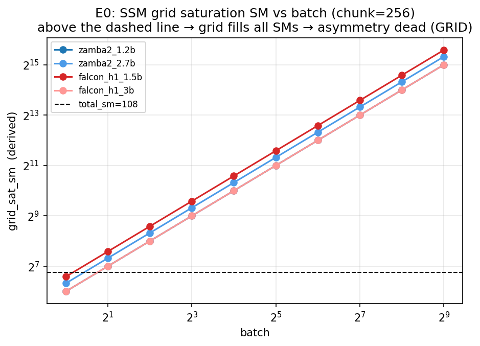
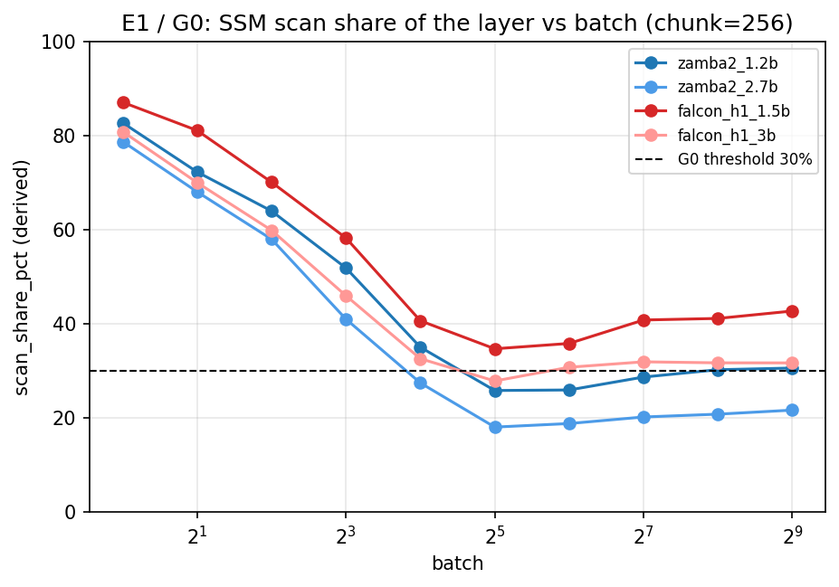
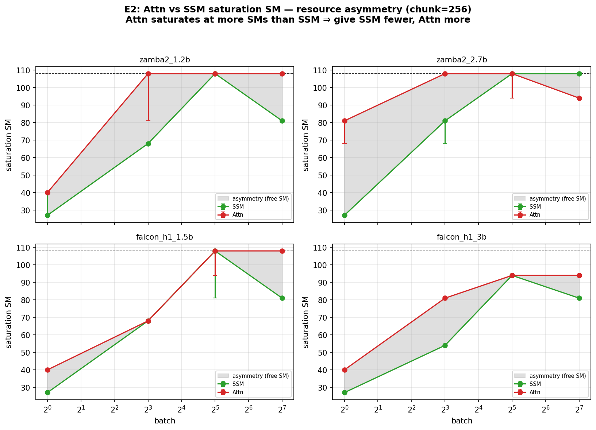
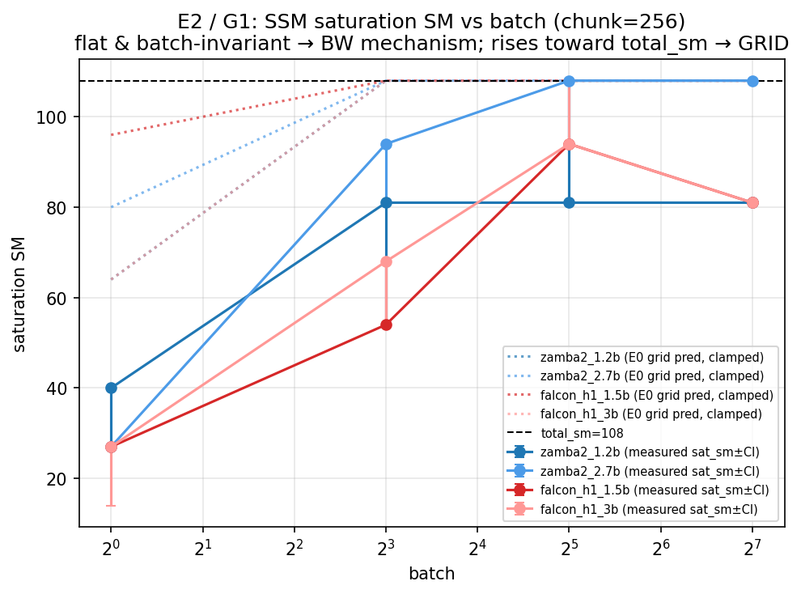
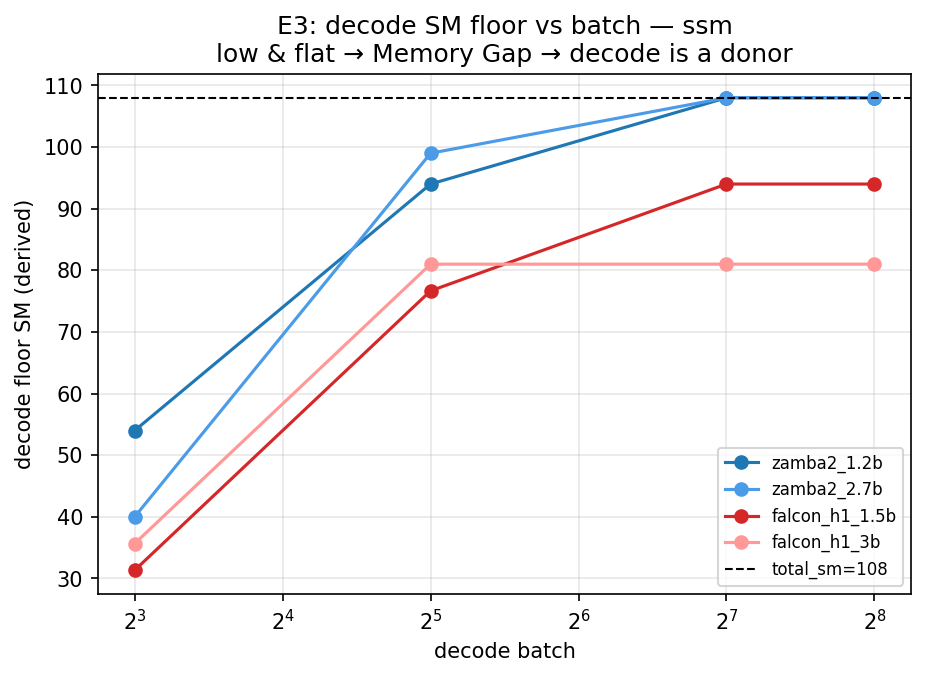
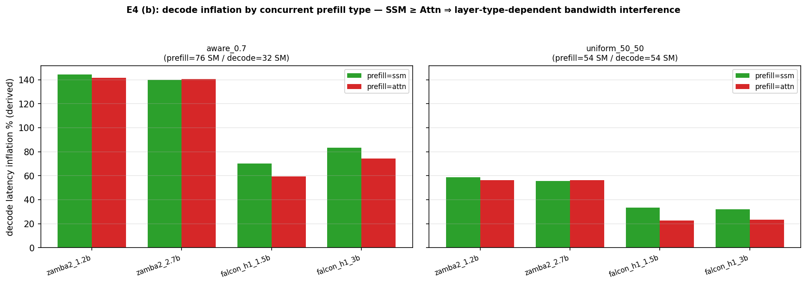
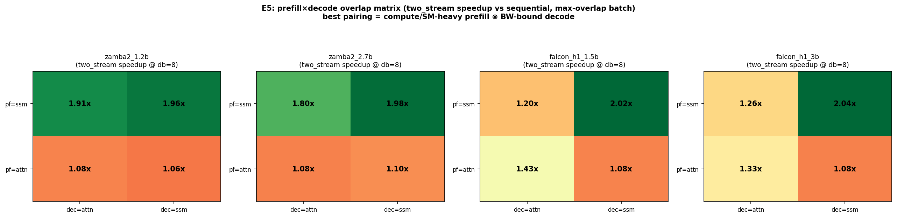
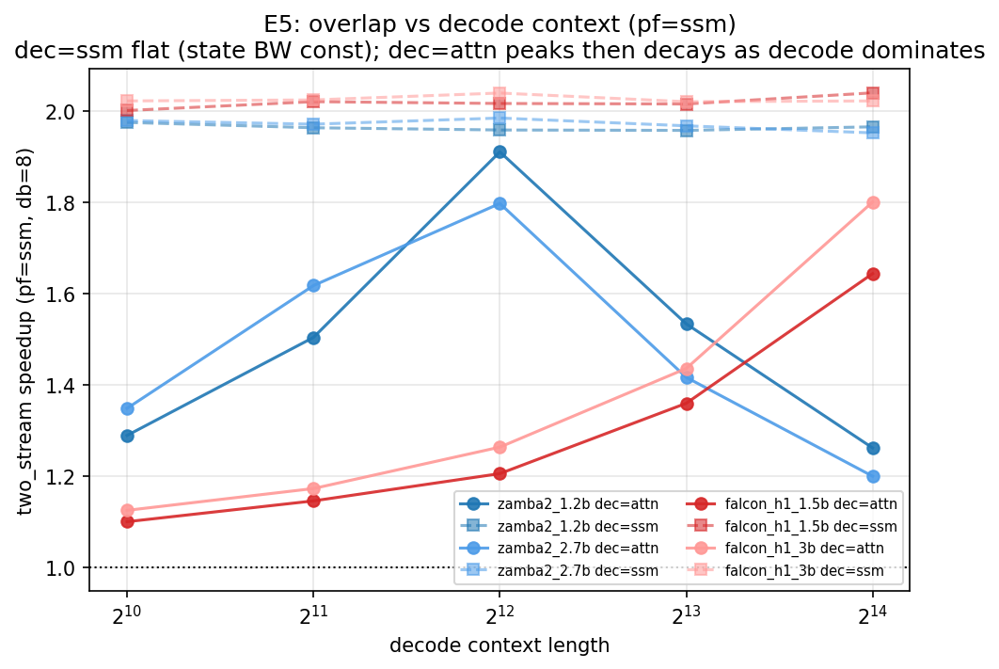
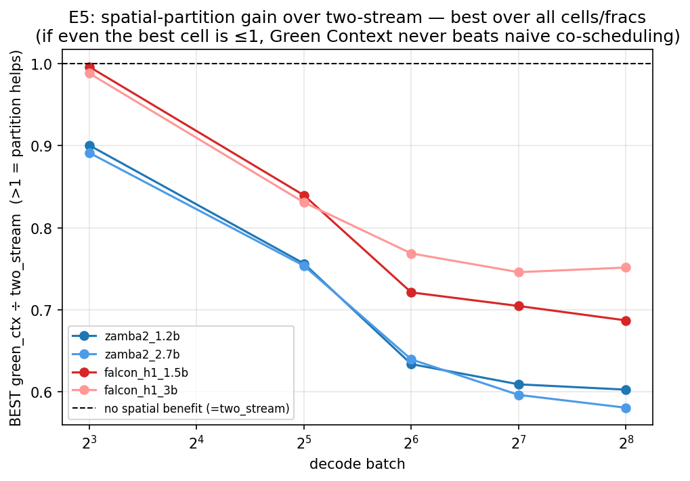

# Hybrid SSM+Attention Serving: SM 할당 비대칭 연구 (v2)

**대상:** Zamba2-1.2B/2.7B, Falcon-H1-1.5B/3B-Base · **하드웨어:** NVIDIA A100-SXM4-80GB (108 SM, HBM 2039 GB/s)
**날짜:** 2026-06 · **상태:** E0–E5 완료, G0/G1 게이트 판정 완료

---

## TL;DR

1. **attention과 SSM 사이의 자원 비대칭은 실재한다.** prefill에서 attention은 SSM보다 더 많은 SM에서 포화한다(E2, CI-분리 gap 13–54 SM).
2. **그러나 그 비대칭은 공간적 SM 분할(Green Context)로 활용되지 않는다.** prefill×decode 4셀 × batch × context 전 구간(1576셀)에서 Green Context 분할은 단순 two-stream 동시실행을 **단 한 번도 이기지 못했다**(max `two_stream/green_ctx` = 0.987–0.996).
3. **serving의 실이득은 prefill+decode overlap(최대 ~2×)이며, 이는 분할 없이 naive 동시실행(MPS/multi-stream)으로 공짜로 얻어진다.** 이득은 decode batch가 GPU를 채우면 닫힌다(2.04→1.15× by batch 256).
4. **결론:** SLM/A100 조합에서 layer-type 기반 공간 SM 분할은 비용 > 이득. "분할하지 말고 co-schedule하라." 비대칭은 *서술적 사실*이지 *할당 손잡이*가 아니다.
5. 남은 단일 검증점: **7B(큰 커널) 회귀** — 분할 무용이 SLM 특이성인지.

---

## 1. 배경과 RQ — v1 → v2 전환

v1은 7B 하이브리드에서 "prefill layer-type별 SM **포화점이 몇인가**"를 물었으나, 측정 자체에 결함이 있었다(full-layer scope로 scan이 GEMM에 가려짐, `n_blocks` ~28× 오류, **batch 축 부재**). v2는 이를 교정했다:

- **측정 교정(유효):** component 분해(E1)로 scan 분리 · 보정된 단일출처 `n_blocks` · **batch 축 추가** · BandwidthEstimator 도입.
- **모델 축소:** 7B → SLM/mid (1.2B/1.5B/2.7B/3B).
- **RQ 재설정(부분적 과오):** "포화점" → "포화 **메커니즘**이 BW냐 grid냐"를 단일 게이트(G1)로. → 이게 *layer-alloc thesis*(attn/ssm 자원 비대칭의 활용)를 부차 질문으로 좁힌 실수였고, 분석 중 **G1을 "attn vs ssm sat_sm 비대칭" 기준으로 재정의**했다(§5.3).

v1 산출물은 `archive/v1_7b_saturation/`에 동결.

---

## 2. 대상 모델 (HF config.json에서 추출, `shared/configs/fetch_hf_model_configs.py`)

| model | hidden | layers | mamba n_heads | head_dim | d_state | **chunk** | attn heads/kv/dim | ffn |
|---|--:|--:|--:|--:|--:|--:|---|--:|
| zamba2_1.2b | 2048 | 38 | 64 | 64 | 128 | 256 | 32/32/128 | 8192 |
| zamba2_2.7b | 2560 | 54 | 80 | 64 | 64 | 256 | 32/32/160 | 10240 |
| falcon_h1_1.5b | 2048 | 24 | 48 | 64 | 256 | **128** | 8/2/128 | 4608 |
| falcon_h1_3b | 2560 | 32 | 32 | 128 | 256 | **128** | 10/2/128 | 6144 |

Zamba2 = 시간축 sparse hybrid(대부분 Mamba, 일부 shared-attn) · Falcon-H1 = 모든 레이어에서 SSM+Attn 병렬. (Falcon mamba chunk_size=128 주의.)

---

## 3. 방법론

- **실험 체인:** E0(해석적 wave 예측, GPU 불필요) → E1(component 분해, G0) → E2(SM×batch 포화 sweep, G1) ∥ E3(decode floor) → E4(concurrent A/B) → E5(serving prefill×decode 매트릭스). 게이트는 `experiments/gates/adjudicate.py`.
- **측정 원칙:** 모든 CSV 컬럼에 `measured`/`derived`/`metadata` 라벨 강제. `measured`=CUDA-event latency·achieved BW; `derived`=n_blocks·waves·util·포화점 CI.
- **포화점은 점추정 금지, n≥30 bootstrap CI.** subprocess 격리(저SM SSM illegal-access/deadlock 방지).
- **BW 계측 신뢰성 경고(중요):** `ssm_scan_bytes`는 recurrent state 트래픽을 누락(과소), `attn_bytes`는 SDPA의 L2-캐시 KV를 과대계상 → **절대 BW%는 비신뢰**(attn에서 >100% 발생). 따라서 메커니즘 판정은 절대 BW%가 아니라 **CUDA-event latency 기반 sat_sm + E0 grid 예측**에 의존한다.

---

## 4. 결과

### 4.1 E0 — 해석적 grid 예측 (GPU 불필요)
`grid_sat_sm = batch·⌈tokens/chunk⌉·n_heads`. batch=1에선 SSM grid가 SM을 다 못 채워 여유 존재(`asym_headroom=True`), **batch≥8부터 grid가 전 SM을 초과**(False) → "grid 메커니즘이라면 batch↑에서 비대칭이 죽는다"는 사전 예측. swap 비용은 v1 archive에서 ~7.8 µs/swap.


### 4.2 E1 — prefill component 분해 → **G0 = OK**
in_proj / scan / out_proj 분해. scan share는 batch=1에서 ~80–87%(scan 지배)지만 큰 batch에서 Zamba는 **<30%**로 떨어짐(GEMM 지배). G0(scan이 유의미한 component인가) 통과.


### 4.3 E2 — SM×batch 포화 sweep → **G1 = ASYMMETRY_PRESENT (재정의)**
attention의 포화 SM이 SSM보다 항상 크다(CI-분리). 측정 sat_sm 비대칭(chunk=256):

| model | gap(attn−ssm) | CI-분리 batch |
|---|--:|---|
| zamba2_1.2b | +27 SM | b8–128 |
| zamba2_2.7b | +54 SM(b1) | b1 |
| falcon_h1_1.5b | +13–27 | b128 |
| falcon_h1_3b | +13 | b1,8,128 |

메커니즘(서술적): SSM은 포화 시 BW util 0.3–12% → grid/overhead-bound이며 종종 grid 예측보다도 일찍 포화(launch/occupancy-bound). Attn은 18–150%(BW/compute-bound). **G1을 "SSM이 BW-bound인가"(구) → "attn-ssm sat_sm 비대칭이 CI-분리되어 존재하는가"(신)로 재정의**, 결과 4/4 모델 ASYMMETRY_PRESENT. (구 기준은 GRID 결과를 "기각"으로 오분류했음.)



### 4.4 E3 — decode SM floor / Memory Gap
작은 decode batch에선 floor가 낮고(~54 SM) 평탄 → 자유 SM 존재(donor). **그러나 batch≥128에선 floor→108**(zamba), 94(falcon ssm) → 큰 batch에서 decode가 전 SM 점유, 자유 SM 소멸. ssm-decode floor는 context에 불변(state BW 상수).


### 4.5 E4 — concurrent A/B (단일 운영점)
- prefill–prefill overlap: `overlap_ratio≈1.0`(두 prefill은 안 겹침), layer-aware split은 +1–7%뿐.
- decode interference: 동시 prefill 종류별 decode 지연 inflation에서 **SSM prefill ≥ Attn prefill**(Falcon Δ8–12pp) — layer-type 의존 간섭 존재. aware split(prefill 76/decode 32)은 decode를 굶겨 +60–144%.


### 4.6 E5 — serving prefill×decode 매트릭스 (핵심)
prefill{ssm,attn} × decode{attn,ssm} × decode_batch{8..256} × context{1k..16k} × backend{sequential, two_stream, green_ctx@f}.

**(A) overlap은 prefill 쪽 크기가 결정.** two_stream speedup @db8,ctx4096: pf=ssm 행 1.8–2.04×, pf=attn 행 1.06–1.43×. 최고 셀은 pf=ssm×dec=ssm(~2.0×) — roofline 상보성이 아니라 **duration matching**(비슷한 길이의 두 scan이 SM 풀에 함께 들어가 거의 완전 overlap).


**(B) decode type는 context 스케일링으로만.** dec=ssm은 context 1k→16k 평탄 ~2.0×(state BW 상수); dec=attn은 balance 의존(긴 context로 decode가 벽시간을 지배하면 overlap↓).


**(C) window는 decode batch로 닫힘:** best 셀 2.04(db8)→1.15(db256).

**(D) spatial 분할은 전 구간에서 무용:** `max(two_stream/green_ctx)` over 모든 셀/batch/context = **0.987(zamba) / 0.996(falcon)** → Green Context가 two_stream을 한 번도 못 이김.


---

## 5. 종합 해석 — 왜 prefill/decode 비대칭은 이득이고 attn/ssm은 아닌가

mux/disaggregation 이득의 전제는 **(1) 독립적 스케줄 단위 + (2) 병목 상보성(한쪽이 남긴 자원을 다른 쪽이 채움)**이다.

- **prefill↔decode:** 별개 요청의 작업이고(독립 단위, KV로 깨끗한 handoff), decode는 SM/compute를 놀려(BW-bound) prefill이 채운다(상보성) → overlap 이득. E5에서 ~2×, 단 decode가 GPU를 채우면(큰 batch) slack 소멸 → 1.15×.
- **attn↔ssm(prefill 내부):** 같은 forward pass의 **데이터-의존 부분단계**(독립 단위 아님 — "attention만 모은 배치"를 만들 수 없고, 레이어마다 activation 결합이라 disagg 불가)이며, prefill 단계에서 **같은 SM/HBM 파이를 같은 시점에 경쟁**(상보성 없음). 그래서 분할은 둘 다 느리게 할 뿐(E4·E5).

**핵심:** attn/ssm 비대칭은 *solo 커널의 포화점 차이*(올바른 활용 도구가 없는 축)이고, prefill/decode 비대칭은 *분리 가능한 작업 간 병목 상보성*(mux/disagg가 먹는 축)이다. 게다가 E5는 그 overlap조차 **공간 분할이 아니라 HW 공동스케줄링이 더 잘 회수**함을 보였다 — 작은 SLM 커널은 full SM 풀에서 잘 겹치므로 하드 파티션의 경직성이 손해.

---

## 6. 한계

- **microbench:** E5는 prefill chunk 1개(batch=1, scan-only) + decode step 1개, n_measure=20. 실제 prefill엔 GEMM·다중 chunk 포함(`--prefill-layer ssm_full`로 점검 가능). 단 정성 결론(분할 무용 / overlap∝prefill크기 / window 닫힘 / ssm-decode context-평탄)은 1576셀에서 일관.
- **two_stream 정의:** `concurrent_ms = max(두 스트림)` — overlap을 정확히 포착(2× 천장이 증거)하나 진짜 MPS 서버는 아님(별도 프로세스 필요).
- **BW 절대값 비신뢰**(§3) — 메커니즘 결론은 latency 기반 sat_sm에 의존.
- **A100 + SLM 한정.** "분할 무용"은 작은 커널이 full 풀에서 co-schedule 잘 되기 때문일 수 있음 → 7B 큰 커널에서 결과가 다를 여지.
- 게이트는 자동 보조이며 **최종 판정은 사람**.

---

## 7. 결론 & 권고

1. **v2의 핵심 가설(layer-type 기반 공간 SM 분할)은 SLM/A100에서 포괄적으로 기각.** Green Context 분할은 어떤 prefill×decode 셀·batch·context에서도 단순 동시실행을 못 이긴다.
2. **serving 권고:** prefill+decode를 공유 SM에 **그냥 co-schedule**(MPS/multi-stream). 저~중 decode batch에서 ~1.2–2.0×, 고batch·long-context에서 소멸. 분할도 layer-type-aware 할당도 불필요.
3. **attn/ssm 비대칭의 쓸모(할당 아님):** kernel fusion/튜닝 신호(ssm가 작아 일찍 포화), 모델↔하드웨어 매칭, layer별 quant/offload 우선순위.
4. **다음 단계(결정적):** **7B 회귀** — configs에 7B 존재. E2·E5를 7B로 재실행해 "큰 커널이 SM을 포화시키면 분할이 의미를 갖는가"를 확인. negative면 "hybrid serving에서 SM 파티셔닝 불필요"가 모델 크기 무관 결론으로 확정.

---

## 8. 재현

```bash
cd workspace/characterization
# 전체 게이트 파이프라인(E0 inline → E1/E2/E3 → gates → E4), 잡 한도 throttle
MAXQ=2 env -u BASH_ENV bash experiments/slurm/run_pipeline.sh
# E5 serving 매트릭스(모델당 array)
env -u BASH_ENV bash experiments/slurm/submit_size_sweep.sh e5 -- --context-lens 1024 2048 4096 8192 16384
# 게이트 재판정 / 그림
env -u BASH_ENV $REPO/bin/python experiments/gates/adjudicate.py
env -u BASH_ENV $REPO/bin/python experiments/viz/plot_results.py
```
> 클러스터 주의: lmod `BASH_ENV`가 non-interactive bash를 깨므로 `env -u BASH_ENV` 필수. `amd_a100nv_8`는 GPU 요청 필수(스크립트가 처리).

## 9. 산출물
- 데이터: `results_v2/{e0,e1,e2,e3,e4,e5}/*.csv` (measured/derived 라벨), 판정 `results_v2/verdicts/{g0,g1}_verdict.json`
- 그림: `results_v2/figures/*.png` (19종)
- 코드: `experiments/{common,e0_analytical,e1_prefill_decomp,e2_sm_saturation,e3_decode_floor,e4_concurrent,e5_serving,gates,viz,slurm}/`
- v1 동결: `archive/v1_7b_saturation/`
